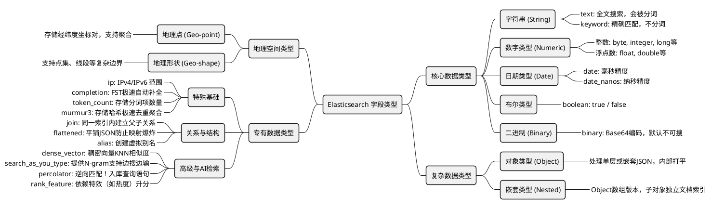

# Elasticsearch 字段类型思维导图与详解

## 思维导图

下面是使用 Mermaid 语法渲染的 Elasticsearch  字段类型思维导图：



---

## 字段类型特点与实战使用场景

以下整理了 Elasticsearch 各大主流类型在真实业务场景中的**映射 (Mapping)** 设置以及**查询 (DSL)** 示例。

### 一、 核心数据类型：字符串 (text & keyword)

*   **文本型 (`text`)**:
    *   **特点**: 用来进行大段文本的模糊模糊、倒排索引全文搜索。入库时会被分词器拆分成独立词项。不支持聚合汇总。
    *   **使用场景**: 博客文章的**正文 (`content`)**、商品的**标题 (`title`)** 等需要包含关键字即可搜索出来的长字段。
*   **关键字型 (`keyword`)**:
    *   **特点**: 不进行分词，当作一个不可分割的整体建立索引。用于**精确匹配、聚合、排序**。
    *   **使用场景**: 用户的**邮箱 (`email`)**、商品的**状态 (`status`)**、文章的**标签数组 (`tags`)**。

**【代码示例】映射与查询**
```json
// 1. 创建映射 (Mapping)
PUT /my_blog
{
  "mappings": {
    "properties": {
      "title": { "type": "text" },        // 标题，用于全文检索
      "category": { "type": "keyword" }   // 分类，用于精确匹配和聚合统计
    }
  }
}

// 2. 查询数据 (Query)
POST /my_blog/_search
{
  "query": {
    "bool": {
      "must": [
        { "match": { "title": "Elasticsearch 入门" } },  // text使用match进行分词全文搜索
        { "term": { "category": "技术教程" } }           // keyword使用term进行精确过滤
      ]
    }
  }
}
```

### 二、 核心数据类型：数字、日期与布尔

这几类是构建结构化查询的中坚力量。虽然它们不能像 `text` 那样分词，但在“精准过滤”和“范围扫描”上性能极其强悍。

#### 2.1 数字类型 (`Numeric`)
*   **痛点**：对于价格、库存等需要经常做数学运算（大于、小于、求平均值）的字段，如果当成字符串存，既无法比较大小，聚合性能也会雪崩。
*   **特点**：底层依托复杂的 `BKD-Tree` 数据结构（一种专为多维空间检索设计的树），对于范围扫描（Range Scan）天然亲和。
    *   **整数**：`byte`, `short`, `integer`, `long`
    *   **浮点数**：`float`, `double`
    *   **特殊浮点**：`scaled_float`（比如存价格全网通用的做法——金额乘以 100 存为 long 型整数，既省内存又绝无精度丢失，ES 底层会自动帮你转换）。
*   **使用场景**：**商品价格筛选**、**年龄区间匹配**、库房**余量报警**。

**【代码示例】带缩放因子的金额范围查询**
```json
// 1. 设置 Mapping：用 scaled_float 存金额
PUT /products
{
  "mappings": {
    "properties": {
      "price": { 
        "type": "scaled_float", 
        "scaling_factor": 100    // 内部其实是存一个 long (把原数字乘100)
      }
    }
  }
}

// 2. 插入数据：传入原本带两位小数的 9.99
PUT /products/_doc/1
{ "price": 9.99 }                // 内部自动存为 999 整数

// 3. 搜索价格在 5 ~ 15 块钱间的商品
POST /products/_search
{
  "query": {
    "range": {
      "price": {
        "gte": 5.00,
        "lte": 15.00
      }
    }
  }
}
```

#### 2.2 日期类型 (`Date`)
*   **痛点**：文本格式的日期千奇百怪（`2023-11-01`、`01/11/2023`）。不同时区、不同格式不仅容易入库报错，在做按月、按天统计报表时更是一场灾难。
*   **特点**：无论你在 JSON 里塞哪种公认格式的时间字符串（如果你配置了 `format`），ES 在存入的瞬间，都会**统统把它毫秒级地转化为自 Unix Epoch 历元（1970年1月1日）以来的长整型毫秒数（`long`）** 存下来。这保证了查询时的极限速度。
*   **使用场景**：**订单创建时间**、日志**时间序列按天聚合 (Date Histogram)**、**判断某个活动是否过期**。

**【代码示例】灵活的日期相对查询**
```json
// 1. 设置 Mapping: 支持三种时间形态的写入
PUT /orders
{
  "mappings": {
    "properties": {
      "created_at": {
        "type": "date",
        // 允许传入：带时区的强格式 / yyyy-MM-dd / 纯时间戳数字
        "format": "strict_date_optional_time||yyyy-MM-dd||epoch_millis"
      }
    }
  }
}

// 2. 强大的 Date Math (日期数学运算)：查找“过去一星期内”创建的订单
POST /orders/_search
{
  "query": {
    "range": {
      "created_at": {
        "gte": "now-7d/d",   // now代表当前瞬间，减去 7 天，/d 表示向下取整到今天当天的凌晨零点
        "lte": "now"         // 止于现在
      }
    }
  }
}
```

#### 2.3 布尔类型 (`Boolean`)
*   **痛点**：有时候你只是想标个 Flag。用字符串存 `"true"` 会经过无用的分析、存数字 `1` 语义不明晰。
*   **特点**：`boolean` 类型直接与 JSON 规范里的 `true`/`false` 绑定，底层存储极为轻量。同时，如果你传字符串 `"true"` 或 `"false"`，它也能包容地解析。
*   **使用场景**：商品**是否上架 (`is_published`)**、用户**是否 VIP (`is_vip`)**、逻辑删除标记位。

**【代码示例】状态标识过滤**
```json
// 1. 设置 Mapping
PUT /users_info
{
  "mappings": {
    "properties": {
      "is_vip": { "type": "boolean" }
    }
  }
}

// 2. 插入数据（直接传原生布尔，不带双引号）
PUT /users_info/_doc/1
{ "is_vip": true }

// 3. 将其作为极其高效的必须过滤器 (Filter)
POST /users_info/_search
{
  "query": {
    "bool": {
      "filter": [
        { "term": { "is_vip": true } }
      ]
    }
  }
}
```

#### 2.4 二进制类型 (`Binary`)
*   **痛点**：我有一张签名的图片、一个体积不大的 `.pdf` 发票，或者经过加密的一个二进制对象串，如果拆成字段太浪费时间，不如一把梭哈连在这个文档记录上一起归档得了。
*   **特点**：只进不出的档案柜。`binary` 字段专门接收 **Base64** 编码转换后的长字符串。它**默认连倒排索引都不建，根本不允许你根据这个字段去检索或者聚合**。它唯一的使命就是你把整个 Document 拉回业务代码时，原封不动地还给你。
*   **使用场景**：**嵌入微小的缩略图/电子签名图片数据**、**保存密集的加密报文/序列化后的私有对象数据**。

**【代码示例】归档纯二进制密文**
```json
// 1. 设置 Mapping
PUT /contracts
{
  "mappings": {
    "properties": {
      "contract_code": { "type": "keyword" },
      // 声明签名图片为 binary（不可搜索）
      "signature_image_base64": { "type": "binary" } 
    }
  }
}

// 2. 插入数据 (放入长长的 base64 字符串)
PUT /contracts/_doc/1
{
  "contract_code": "CT-9088",
  "signature_image_base64": "UklGRhoAAABXRUJQVlA4TA0AAAAvAAAAEAcQBQBgRw==" 
}

// 3. 查询时，根据别的条件(contract_code)搜，顺带把这坨数据一块带回给你展示
POST /contracts/_search
{
  "query": {
    "term": { "contract_code": "CT-9088" }
  }
}
```

### 三、 复杂数据类型：对象与嵌套

这两个类型不仅重要，而且是 Elasticsearch 新手踩坑的重灾区。它们都用于处理 JSON 中的对象结构，但在处理**数组**时表现截然不同。

#### 3.1 对象类型 (`Object`)
*   **痛点（大坑）**：Elasticsearch 原生是拍平结构（Flattened）的倒排索引表。如果你存了一个包含多个对象的 JSON 数组，比如 `[{"name": "Alice", "age": 20}, {"name": "Bob", "age": 30}]`。它在底层会被暴力拆解为 `name: [Alice, Bob]` 和 `age: [20, 30]`。
    此时，如果你搜索 `"名字叫 Alice 且 年龄为 30"`，**这条记录居然能被搜出来！**，因为属性之间的跨对象独立绑定关系（边界）彻底丢失了。
*   **特点**：默认的单层或多层 JSON 大括号结构都会被推断为 `object`。由于不需要维护文档之间的隐藏拓扑，检索单体对象时速度极快。
*   **使用场景**：**单一实体的附属详细信息**（如某个用户的 `address` 对象，里头只有这一个用户的省、市、街道信息）。

**【代码示例】处理单一层级对象**
```json
// 1. 设置 Mapping：经理对象下包含独立属性
PUT /departments
{
  "mappings": {
    "properties": {
      "manager": { 
        "properties": {
          "name":  { "type": "keyword" },
          "title": { "type": "keyword" }
        }
      }
    }
  }
}

// 2. 插入部门数据
PUT /departments/_doc/1
{
  "manager": {
    "name": "John Doe",
    "title": "CTO"
  }
}

// 3. 点号写法：常规的对象层级搜索
POST /departments/_search
{
  "query": {
    "bool": {
      "must": [
        { "term": { "manager.name": "John Doe" } },
        { "term": { "manager.title": "CTO" } }
      ]
    }
  }
}
```

#### 3.2 嵌套类型 (`Nested`) 🚨
*   **痛点**：用来专门解决上述 `Object` 在面对“对象数组”时关系丢失的毁灭级灾难。
*   **特点**：`nested` 是 Object 的一个高阶版本。它不仅能保存内部的 JSON 结构，而且在存盘时，它会偷偷地**将数组里的每一个独立子对象，都当作一个隐藏的完整子级 Lucene 文档**单独建立索引。这就保证了在查询时，条件必须全部命中同一个子块（同一个小文档）才能算过关。
*   **使用场景**：记录一笔巨大主订单下的**多个独立明细商品条目 (`order_items`)**、商品实体挂载的**多条长独立评论 (`comments`)**。

**【代码示例】严谨解决对象数组越界查询**
```json
// 1. 设置 Mapping：必须明文告知 ES 这个字段绝不能拍平聚合！
PUT /orders
{
  "mappings": {
    "properties": {
      "order_id": { "type": "keyword" },
      // 声明它是一组严格隔离边界的子对象表
      "order_items": {
        "type": "nested",
        "properties": {
          "product_name": { "type": "keyword" },
          "quantity":     { "type": "integer" }
        }
      }
    }
  }
}

// 2. 插入一天带有多件子商品的订单
PUT /orders/_doc/1
{
  "order_id": "OD-2023-A",
  "order_items": [
    { "product_name": "Macbook", "quantity": 1 },
    { "product_name": "Mouse", "quantity": 5 }
  ]
}

// 3. 极其严苛地查找：“同一个子订单记录”里既包含Macbook，同时数量>=2 !
// 结果：搜不到！因为虽然总订单里有满足条件的数据，但并没有任何单条明细同时满足。
POST /orders/_search
{
  "query": {
    "nested": {
      "path": "order_items",     // 必须套一层 nested 并指明作用域
      "query": {
        "bool": {
          "must": [
            { "term":  { "order_items.product_name": "Macbook" } },
            { "range": { "order_items.quantity": { "gte": 2 } } }
          ]
        }
      }
    }
  }
}
```

### 四、 地理空间类型：地理点与地理形状

要在地图上搞事情？这两兄弟是 Elasticsearch 的主场。基于地球曲率（甚至是扁平图）的坐标换算、范围圈选，它们在底层有专门的 BKD-Tree 算法加速。

#### 4.1 地理点 (`geo_point`) 📍
*   **痛点**：数据库里有上百万家餐馆的经纬度。用户打开手机，要求立刻选出“离我当前定位 3 公里以内的所有餐馆，按距离从近到远排序”。如果用传统关系型数据库写三角函数去算是灾难级的。
*   **特点**：它就存地球上的一个“点”（经度 `lon`，纬度 `lat`）。支持极其丰富的空间过滤，比如：中心圆点辐射范围 (`geo_distance`)、矩形框选 (`geo_bounding_box`)、甚至异形多边形框选 (`geo_polygon`)。
*   **使用场景**：**外卖 App 附近门店检索**、**共享单车车辆寻址**、**打车软件附近可用司机查询**。

**【代码示例】搜索附近 5 公里内的人**
```json
// 1. 设置 Mapping：声明坐标类型
PUT /users_location
{
  "mappings": {
    "properties": {
      "user_name": { "type": "keyword" },
      "location": { "type": "geo_point" }   // 专门存经纬度的点
    }
  }
}

// 2. 插入数据：支持 [经度, 纬度] 数组形式，或纬经度字符串 "lat, lon" 等等
PUT /users_location/_doc/1
{
  "user_name": "Alice",
  "location": [116.397, 39.904] // 存入北京故宫的经纬度
}

// 3. 核心大招：以天安门为圆心，画一个 5 公里的圈找人，并按距离从近到远排序！
POST /users_location/_search
{
  "query": {
    "bool": {
      "filter": {
        "geo_distance": {
          "distance": "5km",          // 半径 5 公里
          "location": {
            "lat": 39.903,            // 圆心：我的当前坐标
            "lon": 116.397
          }
        }
      }
    }
  },
  "sort": [
    {
      "_geo_distance": {              // 按离我的绝对距离排个序
        "location": {
          "lat": 39.903,
          "lon": 116.397
        },
        "order": "asc",               // 升序，越近越靠前
        "unit": "km"
      }
    }
  ]
}
```

#### 4.2 地理形状 (`geo_shape`) 🗺️
*   **痛点**：有时候存的不是一个点。比如你划拉了一个“免配送费配送大区”，或者“杭州西湖的湖面轮廓线”，亦或是一条“京直高铁线路”。当你想知道用户的坐标点 `(116.397, 39.904)` 是否落在这个**不规则的配送区网格内**，或者两条公路线是否相交时，点类型就无能为力了。
*   **特点**：它拥抱 GeoJSON 标准！可以存复杂的形状集合：线 (`LineString`)、多边形 (`Polygon`)、多重多边形 (`MultiPolygon`)。查询能力极其强大，支持相交 (`intersects`)、包含 (`within`)、分离 (`disjoint`) 等空间关系计算。
*   **使用场景**：**电子围栏打卡检测**、**无人机禁飞区规避**、**指定商圈配送范围判断**。

**【代码示例】电子围栏：判断我的车是不是开进了禁区**
```json
// 1. 设置 Mapping：声明可以存多边形
PUT /restricted_zones
{
  "mappings": {
    "properties": {
      "zone_name": { "type": "keyword" },
      "area_geometry": { "type": "geo_shape" }  // 存一整块多边形地理区域
    }
  }
}

// 2. 插入一个禁停区（标准的 GeoJSON 格式的多边形顶点连线）
PUT /restricted_zones/_doc/1
{
  "zone_name": "Central Park No-Parking Area",
  "area_geometry": {
    "type": "polygon",
    "coordinates": [
      [ [100.0, 0.0], [101.0, 0.0], [101.0, 1.0], [100.0, 1.0], [100.0, 0.0] ] // 闭合的多边形环
    ]
  }
}

// 3. 此时一台车发送了他的坐标点，检测他目前处于库里的哪个禁停区？
// （用一个 point 形状去 "intersects" 数据库里的多边形）
POST /restricted_zones/_search
{
  "query": {
    "bool": {
      "filter": {
        "geo_shape": {
          "area_geometry": {
            "shape": {
              "type": "point",
              "coordinates": [100.5, 0.5]  // 车辆当前的坐标系
            },
            "relation": "intersects"       // 空间关系：看看有没有相交/落在那个圈里！
          }
        }
      }
    }
  }
}
```

### 五、 专有数据类型 (Specialised Datatypes)

这部分包含了 Elasticsearch 为特定、高阶的业务难题量身定制的数据结构。以下是 4 种最常用的专有类型详解：

#### 5.1 自动补全词条 (`completion`)
*   **痛点**：用户在搜索框刚敲入两三个字母（比如 "ela"），系统必须在 10 毫秒内立马下拉弹出 "Elasticsearch"。如果用常规的 `text` 去搜，速度太慢了。
*   **特点**：`completion` 类型根本不用传统的“倒排索引”，而是将数据全部装载进内存里的特殊树形结构（有限状态转换器 FST）。它牺牲了修改和聚合的能力，换取了**极限的前缀匹配速度**。
*   **使用场景**：搜索引擎的**输入框打字联想**、**商品自动下拉提示**。

**【代码示例】搜索补全**
```json
// 1. 设置 Mapping：专门为该字段开启 completion 功能
PUT /search_hints
{
  "mappings": {
    "properties": {
      "suggest_word": { "type": "completion" } 
    }
  }
}

// 2. 插入数据
POST /search_hints/_doc/1
{ "suggest_word": "Elasticsearch 入门指南" }

// 3. 用户刚输入 "Ela"，立刻向 ES 发起 suggester 提示查询
POST /search_hints/_search
{
  "suggest": {
    "my_suggestion": {
      "prefix": "Ela",           // 用户的实时输入
      "completion": {
        "field": "suggest_word", // 去哪个补全库里找
        "size": 5                // 最多弹 5 个联想词
      }
    }
  }
}
```

#### 5.2 IP 地址 (`ip`)
*   **痛点**：把 IP 地址当做字符串存？那你只能进行傻瓜式的字符串绝对相等匹配。如果你想查“这个人的 IP 是不是在 `192.168.1.0/24` 这个网段内”，字符串类型就彻底拉垮了。
*   **特点**：`ip` 类型原生理解 IPv4 和 IPv6 格式。它可以高效地进行大范围的网络掩码（CIDR）匹配判断。
*   **使用场景**：**系统访问日志审计**、**封锁恶意 IP 网段防爬虫**。

**【代码示例】网络端点查询**
```json
// 1. 设置 Mapping
PUT /access_logs
{
  "mappings": {
    "properties": {
      "user_ip": { "type": "ip" }
    }
  }
}

// 2. 找出所有来自 192.168 前缀网段的访问记录
POST /access_logs/_search
{
  "query": {
    "term": {
      "user_ip": "192.168.0.0/16"  // 完美支持网段掩码过滤！
    }
  }
}
```

#### 5.3 词项数量 (`token_count`)
*   **痛点**：我想找出“名字刚好是三个字的人”或者“文章字数小于 500 个单词的超短文”，传统的 ES 很难查长度。
*   **特点**：这个类型其实是对某段文本的“附属统计”。它不存原始的文本，而是用分词器把你的句子切开后，**仅仅把切出来的单词（Token）的数量当成一个整数存下来**。
*   **使用场景**：**限制查询标题长度不能太短的垃圾贴**、**统计一篇文章的干货单词数**。

**【代码示例】查询文字长度**
```json
// 1. 设置 Mapping：一式两份！一个存内容，一个存长度
PUT /articles
{
  "mappings": {
    "properties": {
      "content": { 
        "type": "text",             // 用来正常搜索内容的
        "fields": {
          "length": {               // 给这个字段挂一个“子字段”
            "type": "token_count",  // 类型是统计分词数量
            "analyzer": "standard"  // 按标准英文空格切词来数数量
          }
        }
      }
    }
  }
}

// 2. 我只想看“大于 1000 个单词的长篇文章”
POST /articles/_search
{
  "query": {
    "range": {
      "content.length": { "gt": 1000 } // 直接对这个数字副产品去施加范围查询
    }
  }
}
```

#### 5.4 极速哈希 (`murmur3`)
*   **痛点**：你想统计今天有**多少个独立不同的设备 ID**（基数去重统计 `cardinality`）。如果你直接拿几十字节长的设备字符串去比对排重，碰到千万级数据量不仅极其耗内存，而且 CPU 慢得卡死。
*   **特点**：它能在数据写入时，自动把你传过来的长文本进行超快的 `Murmur3` 散列算法，算出一个极小的 128 位哈希特征码数字。后续做“是否有重复”的聚合时，ES 直接拿着短小的哈希码去比对，速度快几十倍。
*   **使用场景**：**海量埋点日志计算 UV（独立访客数）**、大文本的去重检测。

**【代码示例】极速独立访客 (UV) 统计**
```json
// 1. 设置 Mapping (通常也是挂在一个普通文本字段下作为“提速外挂”)
PUT /click_logs
{
  "mappings": {
    "properties": {
      "device_id": {
        "type": "keyword",
        "fields": {
          "hash": { "type": "murmur3" }  // 写入时，自动给 device_id 算一个 hash
        }
      }
    }
  }
}

// 2. 根据 Hash 值计算总计有多少个不同用户点了这个按钮
POST /click_logs/_search
{
  "size": 0, 
  "aggs": {
    "unique_users_count": {
      "cardinality": {
        "field": "device_id.hash" // 注意！用 hash 字段去聚合排重，速度吊打原字段！
      }
    }
  }
}
```

#### 5.5 父子关系文档 (`join`)
*   **痛点**：在ES中修改深层嵌套的 `nested` 数组，整条大文档都会被重新索引，极其笨重。如果你有大量“父文档”，且子文档频繁追加、修改（比如博客和几万条评论），用 nested 会导致写入雪崩。
*   **特点**：`join` 允许同一索引内的不同文档建立物理上的“父子绑定结构”。修改子文档时，父文档岿然不动，性能极高。但它的代价是查询非常消耗内存。
*   **使用场景**：**一对多且子文档经常独立更新的场景**（如：一个产品挂载实时变化的上千个报价单）。

**【代码示例】父子关联查询**
```json
// 1. 设置 Mapping：声明 question 是父，answer 是子
PUT /qa_forum
{
  "mappings": {
    "properties": {
      "my_join_field": { 
        "type": "join",
        "relations": { "question": "answer" }  // 父名叫question，子名叫answer
      }
    }
  }
}

// 2. 根据父级文档查子级：找出问题ID为"1"下面的所有回答
POST /qa_forum/_search
{
  "query": {
    "parent_id": {
      "type": "answer",
      "id": "1"
    }
  }
}
```

#### 5.6 拍扁黑洞 (`flattened`)
*   **痛点**：第三方系统传给你一个极其复杂的 JSON 数据结构，里面动态包含了上百层、随时随地变异的未知字段名。如果不加控制塞进 ES，会瞬间触发恐怖的 **Mapping Explosion（映射爆炸）**，拖挂整个集群内存。
*   **特点**：这个类型像一个无底洞。它接到复杂 JSON 后，把它所有的深层属性名带上点号，全部拍平塞进同一个巨大的 `keyword` 字段中去。它不占用内部字段额度（永远只占1个名额）。
*   **使用场景**：只用来过滤不需要精细分词的**动态第三方日志负载 (`payload`)**、**标签元数据 (`labels`)**。

**【代码示例】无脑接受变异 JSON**
```json
// 1. 设置 Mapping
PUT /system_logs
{
  "mappings": {
    "properties": {
      "host_payload": { "type": "flattened" } // 声明这个黑洞
    }
  }
}

// 2. 第三方丢过来一个深不见底的 JSON
POST /system_logs/_doc/1
{
  "host_payload": {
    "os": { "name": "linux", "version": "5.4" },
    "network": { "mac": "aa:bb:cc", "ips": ["1.1.1.1"] }
  }
}

// 3. 像普通 keyword 一样完美查询（只能精确匹配）
POST /system_logs/_search
{
  "query": {
    "term": { "host_payload.os.name": "linux" }
  }
}
```

#### 5.7 字段替身 (`alias`)
*   **痛点**：祖传代码表结构里有个字段叫 `usr_nm`，现在要求给它重构，在外部 API 查询时必须统统改用 `user_name` 字段去查，但你又不能随便停机锁表去重建上百亿的数据迁移。
*   **特点**：零成本为你底层已有的真实字段，创建一个软链接影子。旧数据不用动，新的查询条件和聚合立刻就能使用新名字。
*   **使用场景**：**API 接口版本迭代**、**查询规范化重构字典**。

**【代码示例】无痛字段重命名**
```json
// 1. 挂靠别名
PUT /users/_mapping
{
  "properties": {
    "user_name": {        // 新的外显标准字段
      "type": "alias",    // 它是一个只挂名不存数据的替身
      "path": "usr_nm"    // 它偷偷指向底层丑陋的真实字段
    }
  }
}

// 2. 前端高枕无忧地用新字段去查询
POST /users/_search
{
  "query": {
    "match": { "user_name": "Tom" } // 就像查真字段一样查
  }
}
```

#### 5.8 稠密向量库 (`dense_vector`) 🚀
*   **痛点**：我想通过给丢机器人一张图片，让它在库里找出颜色构图最接近的另一张图。或者输入一段口语化的句子，找出语义含义靠得最近但字完全不一样的文档。传统的文本 ES 倒排索引完全聋哑。
*   **特点**：存储由高阶 AI 模型（如 OpenAI、BGE 产出）转换后的纯浮点数数组。内置底层 HNSW 算法图，专挑空间距离相近的邻居（KNN 余弦或者欧式距离计算）。
*   **使用场景**：**RAG 知识库问答大模型前置查询**、**以图搜图、语义检索**。

**【代码示例】KNN 语义检索匹配**
```json
// 1. 设置 Mapping
PUT /ai_knowledge_base
{
  "mappings": {
    "properties": {
      "content_vector": {
        "type": "dense_vector",
        "dims": 3,               // 向量维度 (生产中大模型出的通常是 768 或 1536 维)
        "index": true,
        "similarity": "cosine"   // 采用余弦夹角衡量两段文字的远近缘分
      }
    }
  }
}

// 2. 模型算出 [0.1, 0.2, 0.3] 后直接拿来大海找针 Top 3
POST /ai_knowledge_base/_search
{
  "knn": {
    "field": "content_vector",
    "query_vector": [0.1, 0.2, 0.3],
    "k": 3,
    "num_candidates": 100
  }
}
```

#### 5.9 边输边搜 (`search_as_you_type`)
*   **痛点**：传统的 `text` 搜索，你必须输入完整的类似 "Apple"，它才去撞词。如果我想做成一边打字 "Ap"，底下就实时出一条完整的结果 "Apple Watch" 怎么办？
*   **特点**：为了这种需求设计的保姆类型。你把一句 "quick brown fox" 丢进去，它在内部切分的时候不光切词，而且会帮你自动拼接分片（N-gram），例如偷偷生成存下 `q`, `qu`, `qui`, `quick b`, `quick brown` 等极大量的中间态组合，用极大占用硬盘空间的代价换取对任意前缀查询极速响应。
*   **使用场景**：**高频互动网页的实时联想内容板**。

**【代码示例】即时组合框**
```json
// 1. 设置 Mapping
PUT /my_website
{
  "mappings": {
    "properties": {
      "my_title": { "type": "search_as_you_type" }
    }
  }
}

// 2. 支持查询半截带组合的长词
POST /my_website/_search
{
  "query": {
    "multi_match": {
      "query": "quick br",  // 输入到一半，能秒出一整句带它的标题
      "type": "bool_prefix",
      "fields": [
        "my_title",
        "my_title._2gram",
        "my_title._3gram"
      ]
    }
  }
}
```

#### 5.10 逆向侦察兵 (`percolator`)
*   **痛点**：有 100 个用户设置了各自的股票告警策略：“茅台超过 2000 块发短信”、“特斯拉低于 150 块发邮件”。这时候来了一条最新的实时股价数据，你到底该把这条数据推送给哪 5 个规则命中的人？难道遍历所有的规则去套吗？
*   **特点**：**反向操作**！正常情况是你存数据，然后用一条语句去查它们。`percolator` 允许你**把这 100 个“查询条件语句（DSL）”当做文档存到 ES 里去**！然后你拿着真实的新数据传进 API 当作“手电筒”，ES 会瞬间照亮告诉你这条数据中了那几条订阅规则。
*   **使用场景**：**高并发系统里的流式监控订阅**、**复杂业务事件告警分发中心**。

**【代码示例】反向订阅测试**
```json
// 1. 设置 Mapping: 你存的不是内容，而是查询语句的实体
PUT /my_alerts
{
  "mappings": {
    "properties": {
      "message": { "type": "text" },
      "alarm_query": { "type": "percolator" } // 专门存查询DSL类型的字段
    }
  }
}

// 2. 存入一条订阅规则文档 (查出message含有"error"的记录)
PUT /my_alerts/_doc/1
{
  "alarm_query": {
    "match": { "message": "error" }
  }
}

// 3. 将真实线上飘过的业务数据当做“条件”发配，去查中了哪些库里的规则文档
POST /my_alerts/_search
{
  "query": {
    "percolate": {
      "field": "alarm_query",
      "document": {           // 拿真实数据去撞击规则！
        "message": "A new error happened in the system"
      }
    }
  }
}
// 返回结果将会是：_id为 1 的那个规则！
```

#### 5.11 排名外挂加分器 (`rank_feature`)
*   **痛点**：虽然 Elasticsearch 根据关键词自己有一套算分（BM25），但业务通常有自己的意志。比如我搜“手机”，结果里有 1 万条。我希望能把“收藏量巨大”、“PageRank极高”的热门手机平滑地顶到前面来，但又不想人工写死复杂生硬的乘法衰减函数公式。
*   **特点**：只能存储单一数值（并且必须为正）。你在查询时调用 `rank_feature`，Elasticsearch 会用极度优化的底层 C 函数基于饱和度曲线平滑自然地给你这条文档的原有的内容得分上增加分值，从而影响最终排序。
*   **使用场景**：**基于淘宝销量的商品防呆提权打分**、**资讯的点击热度排行榜融合**。

**【代码示例】热度融合排位**
```json
// 1. 设置 Mapping
PUT /videos
{
  "mappings": {
    "properties": {
      "title": { "type": "text" },
      "pagerank": { "type": "rank_feature" } // 热指标评分外挂通道
    }
  }
}

// 2. 存入数据
PUT /videos/_doc/1
{ "title": "搞笑视频", "pagerank": 150.5 }

// 3. 既要求搜“搞笑”，同时依赖 pagerank 自然外挂升分
POST /videos/_search
{
  "query": {
    "bool": {
      "must": [
        { "match": { "title": "搞笑" } }
      ],
      "should": [
        { "rank_feature": { "field": "pagerank", "boost": 0.5 } } // 叠加热度外围分
      ]
    }
  }
}
```
