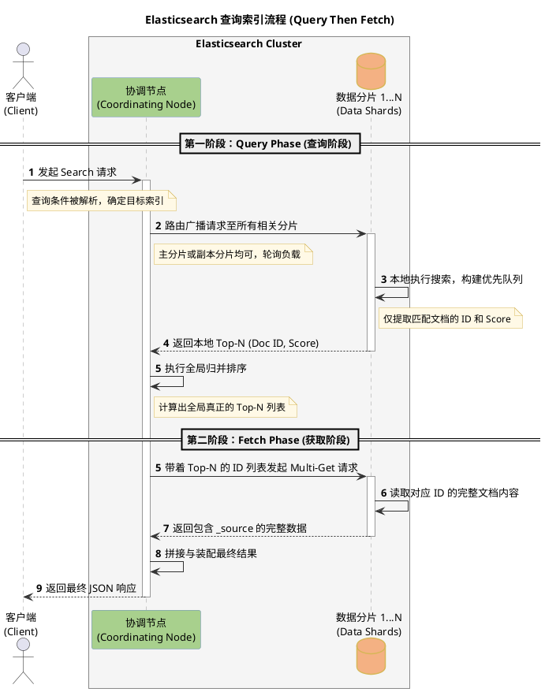

# Elasticsearch 查询索引流程 (Query Then Fetch)

Elasticsearch 最常见、也是默认的分布式搜索执行逻辑被称为 **Query Then Fetch（先查询，后获取）**。这个过程分为两个主要阶段，以确保在分布式架构下能够高效、准确地拿到 Top-N 的结果。

## 流程图 (PlantUML)

---

## 流程详细说明

### 第一阶段：Query Phase（查询阶段）
在这个阶段，系统主要是为了找出 **"哪些文档（Doc ID）符合条件"** 以及 **"它们的分数（Score）排在最前面"**。

1. **接收请求**：客户端（Client）发起一个 Search 请求，集群中接收到该请求的节点充当本次搜索的 **协调节点（Coordinating Node）**。
2. **路由广播**：协调节点解析查询条件，确定需要查询哪些索引。然后将请求转发到对应索引的每个分片（Shard）上。这里它会在主分片（Primary）和副本分片（Replica）中运用轮询策略随机选择一个以实现负载均衡。
3. **本地搜索**：每个收到请求的分片独立在本地执行查询。分片会在内部生成一个大小为 `from + size` 的优先队列（Priority Queue），里面仅包含匹配到的 **Doc ID（文档ID）** 和 **Score（相关性算分）**，**不包含具体的文档内容**（这样极大减少了网络带宽消耗）。
4. **返回与归并**：每个分片将自己的 Top-N `(Doc ID, Score)` 列表返回给协调节点。协调节点将收集到的所有结果集再次进行全局的归并排序运算，最终选出真正的全局 Top-N 文档列表。

### 第二阶段：Fetch Phase（获取阶段）
在明确知道了最终需要的文档 ID 以及它们所在的原始分片后，开始拉取真实的数据内容。

5. **定向拉取**：协调节点拿着全局排序后确认的最终的 Top-N 的 Doc ID 列表，向它们对应的各个数据分片发送 `Multi-Get` 请求获取详细数据。
6. **返回数据**：各个数据分片根据 ID 读取文档的完整内容（如 `_source`、高亮字段等），并将其返回给协调节点。
7. **客户端响应**：协调节点将这些完整的文档数据拼接、装配成最终的 JSON 响应格式，返回给客户端。

> **💡 为什么需要分两步？**
> 对于分布式系统来说，比如你想查排名前 10 的数据。如果直接查完整文档，每个分片都返回 10 条庞大的 JSON 给协调节点，如果有 10 个分片，网络里就会传输 100 条庞大的文档数据，而最终只保留 10 条，造成巨大浪费（**深度分页灾难**）。
> 采用 `Query Then Fetch` 能够让第一遍在网络流转的仅仅是体积极小的 ID 与分数，等最终裁死前 10 名局势后，再精准拉取实际内容，是最优解。