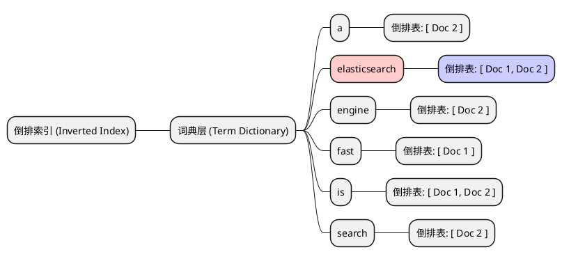

# 深入理解 Elasticsearch：核心优势与极速查询原理

## 一、 什么是 Elasticsearch？

Elasticsearch (简称 ES) 是一个基于 Apache Lucene 构建的**开源、分布式、RESTful 风格的搜索和数据分析引擎**。

它不仅能够解决传统的全文本搜索问题，还能处理海量的结构化或非结构化数据，并在这之上提供近实时（NRT, Near Real-Time）的搜索聚合和分析能力。

> **💡 通俗类比：**
> 
> MySQL 就像是一个严谨的仓库管理员，所有东西必须分门别类按格子放好（表结构限制）；
> 
> 而 **Elasticsearch 就像是一个带有“超级快速检索能力”的无所不知的图书馆长**。不局限于各种长篇文本、数字坐标，只要你丢进它的庞大知识库，它就能神机妙算般地秒速帮你翻出所有想要的图书。

---

## 二、 Elasticsearch 的五大核心优势

ES 之所以能迅速成为各大平台搜索层的“核武器”，主要归功于以下 5 点：

1. **⚡ 快如闪电的查询速度**
   * 无论是全文本短语模糊搜索，还是海量数据的属性过滤、复杂的基数聚合统计，ES 几乎都能在毫秒级（ms）内返回令人满意的结果，真正做到“所搜即所得”。
2. **🏢 天生的分布式与高可扩展架构**
   * 完美支持 **PB 级**巨量数据的无缝拓展存算。数据被自动分片（Shard）存储到数十乃至上百个物理节点上，面对巨大压力时，多节点可以高度并行计算，大大突破了单机的垂直性能瓶颈。
3. **🛡️ 极度安全的高可用性机制**
   * 通过巧妙的**主从分片（Primary & Replica）策略**，配合集群内部的脑裂预防机制。即使某几个物理节点突然当机断电停摆，系统也能无缝自动切换主节点、接管流量、自愈集群绿态，保证数据绝对不丢，搜索服务秒级在线。
4. **🧩 极爽的 Schema-less（弱模式）连入感**
   * 可以直接将任意乱七八糟、毫无章法的第三方复杂 JSON 数据塞入库中。ES 强大的**动态映射 (Dynamic Mapping)** 内核能自动分析它是整形、日期还是超长文本，并默默为你建表拉列（极其方便初期的测试接入）。
5. **生态极其庞大的全家桶支撑**
   * 围绕着 ES 有整个大名鼎鼎的 Elastic Stack 家族，搭配 **Logstash**（数据清洗水管）、**Beats**（底层探针采集兵）和 **Kibana**（酷炫夺目的可视化聚合数据大盘面板），帮你一站式彻底搞定大厂级的数据收集整理检索流程。

---

## 三、 Elasticsearch 的底层黑客级加速原理

这也许是 ES 最引以为傲的地方。很多人惊叹于十几亿记录在 ES 里搜索居然只需要几十毫秒，这一切全依靠它底层极其丧心病狂的诸多**“时间换空间”**数据结构设计：

### 1. 倒排索引 (Inverted Index) —— 全文检索快过光速的基石

很多人第一次听到这个词会疑惑：为什么叫“倒排”？它到底“倒”在哪里？
事实上，这源于它与传统数据库查询找数据时**“查找方向的完全反转”**。

*   **正向索引 (Forward Index) —— “从文档找词”**
    就像一本普通的书。我们拿到这本书的主体（文档 ID），一页一页往下读，才能发现在第几页有我们要找的哪个“关键词”。
    > **查找方向**：`[文档 ID] ---> [文档内容] ---> 匹配查出 [关键词]`
    > **弊端**：你想查“哪些书里有 `Elasticsearch` 这个词？”，对不起，你只能把图书馆所有的书从头到尾全读一遍（全表大扫表 `LIKE '%...%'`）。

*   **倒排索引 (Inverted Index) —— “反向从词找文档”**
    ES 彻底把这个关系倒了过来！它在文章刚录入的时候，就提前把文章全部拆散成词，然后像书的**末尾词汇附录页**一样：专门拿“关键词”当主键领头，在旁边列出包含了这个词的所有“文档 ID”表。
    > **查找方向**：`[关键词] ---> 瞬间匹配背后的 ---> [文档 ID 集合]`
    > **破局点**：方向一反转，当我们需要搜索时，直接根据关键词跳跃到这一行，背后挂着的所有文档 ID 立刻原形毕露，拿来即用！

> **【图解：字典瞬间定位倒排链表】**
>
> 假设录入了两句话：`"Elasticsearch is fast"`(Doc 1) 和 `"Elasticsearch is a search engine"`(Doc 2)。ES 在底层将“从哪篇文档提取哪些词”的入库动作，强行**反转存储**为“哪些词属于哪篇文档”：

**底层核心组成部分：**
1. **词典 (Term Dictionary)**：所有的碎片词条在底层（内存或磁盘）高度排序。搜寻时直接利用二分查找法极大加快跳跃查询，瞬间锁定特定单词。
2. **倒排记录表 (Posting List)**：这是上图的最末端，一个包含了文档 ID 的链表或数组。真实的 Posting List 除了文档 ID，内部还会塞入：
    * **词频 (TF)**：此词在该文章出现的次数，供底层相关性推荐打分（BM25）系统排序。
    * **偏移位置 (Position)**：记录此词所在的字符位置，专门用于返回给前端进行页面的**关键字标红高亮**！

### 2. 内存词典极限压缩变戏法 —— 图结构引擎 (FST)

即使建立了倒排字典，几亿个毫不重复的长单词加起来也是个巨大的天文数字。**全部堆进内存（RAM）会直接宕机，但放入龟速磁盘又会造成高频 IO 卡顿。**

**破局点：** ES 使出了一个名为 **FST ( Finite State Transducer, 有限状态转换器 )** 的绝命底层算法结构进行恐怖的数据压缩。
* **原理**：FST 非常像加强版前缀树，变态的是她不但能合并压缩公用单词的**前头**，竟然还会智能合并相同的单词**后缀结尾段**（极尽压缩之能事）！
* **成效**：使得百亿级数据凝聚成的惊天词典能缩小到几十兆级别从而被彻底存留在珍贵的服务器 RAM 中。

### 3. 多条件相交筛选的降维打击 —— 咆哮位图法 (Roaring Bitmaps) 与跳表

真实实战中我们从不单搜一个孤零零的词，经常是在用几十个复合过滤器叠加卡点。（如：`年级 > 三` AND `性别 = 女` AND `爱好是听歌` AND `籍贯在江苏`）。

ES 能在几个条件背后的庞大 ID 列队中，极速实现求交集求归宿合并：
* **跳表 (Skip List)**：当 ES 把两路符合上述条件的数字列表排起方阵后，能在列表之上建立极高跨度的大跃进查找跳台。
* **咆哮位图 (Roaring Bitmaps)**：当符合要求的文档太多、数组排不开时。ES 会将高频条件的倒排 ID 序列压缩转换成极其节省空间的**二进制比特序列组（010010101...）**。这导致几十万条数据的重叠结果找寻操作在底层直接变成了**CPU 级别的极速逻辑位与非或门芯片层面的运算 (Bitwise AND/OR)**。一百万条信息结果找谁两者符合，CPU 计算位运算连半毫秒都用不上！

### 4. 针对几何空间范围的截断杀手锏 —— BKD-Tree

早期 ES 曾将数值区间 (`11~198`) 、日期也同样视作枯燥字符组去塞进底层大排查遍历，十分缓慢低智。

重装升级后，针对 `Integer`、`Float` 的数值框定、各类公立日期 `Date` 区间与横纵交织地球的 `Geo-point` 空间计算。ES 将其结构通通移架至极其智能快速专门应付高维穿梭的 **BKD-Tree 地理维数树**中。
这导致无论是执行类似“在价格为`100`～`200`框定内，又在距我 `3.2` 公里圈套里的饭馆”，ES 能够在一开始就暴力快速进行分支区域裁剪屏蔽。不再遍历查找数字边缘字符大小排序，将范围区间包线的拉查速度一举提升甩出传统关系库 B+ 树好多倍。

### 5. 文件锁死大法：疯狂白嫖系统层缓存 —— OS Page Cache

ES 官方极其严禁将部署机原本珍贵的 JVM 内存设置太大（官方警告封顶 31Gb 超过即降级）。大家常常纳闷那么剩下的一半多余物理内存该留给哪个程序使用呢？

真相是留给：**操作系统的底层磁盘文件通通换作常驻内存盘层缓存！ (OS Page Cache)**

* **不朽不可变性协议 (Immutability)**：在 ES 的存储内核中，哪怕只有几个字的一段段索引数据文件，一旦刷入了底层磁盘，只要生成就不允许**再改动删除任何哪怕是一个字节的本身内容**！（所谓修改/删除仅是在旁侧建立补丁）。
* **狂野生猛的效用**：这造就了因为底层的文件绝不能有任何变动，操作系统就会极放心甚至欢快长留地将那些被反复检索翻动过的分段查找物理文件全部定格在 **页缓存 (Page Cache)** 一侧长年不清理——不需要设计繁杂争抢悲观文件内容写入读取锁片。以致最后极多令人震撼无比神速磁盘响应 IO 全部都是底层操作系统帮忙在物理毫厘的机器内存在悄悄折回完成的，这就是白嫖到极致的加速表现。
