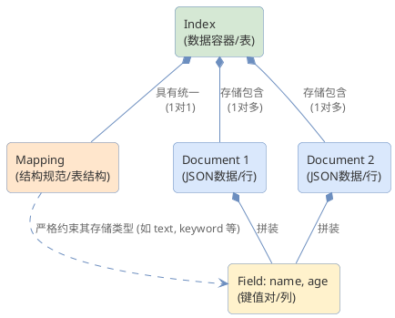

# Elasticsearch 核心概念与关系解析

在 Elasticsearch 中，`Index`、`Type`、`Document`、`Field` 和 `Mapping` 是构建数据模型的基石。理解它们以及它们与传统关系型数据库（如 MySQL）的类比，是掌握 Elasticsearch 的关键。

## 1. 核心概念拆解

### Index（索引）
* **定义**：索引是具有相似特征的文档集合。它是 Elasticsearch 中数据存储和搜索的逻辑命名空间。
* **类比**：在关系型数据库中，索引类似于 **Table（数据表）**（在 Elasticsearch 6.x 及更早版本中，它常被类比为 Database 数据库）。
* **特点**：索引名称必须全小写，且不能包含逗号、空格、`#`等特殊字符。

### Type（类型）
* **定义**：曾经作为索引的逻辑分类或分区，允许在同一索引中存储结构不太相同的文档。
* **类比**：早期的 **Table（数据表）**。
* **历史变迁（重要）**：
  * **ES 5.x 及以前**：一个 Index 里可以包含多个 Type。
  * **ES 6.x**：一个 Index 只能包含一个 Type。
  * **ES 7.x**：Type 概念被完全废弃，默认使用 `_doc` 作为隐式的单个 Type。
  * **ES 8.x**：完全移除 Type 相关的 API。现在，Elasticsearch 提倡一个索引只存储一种结构的数据。

### Document（文档）
* **定义**：文档是可以被索引的基础信息单元，是 Elasticsearch 中的最小数据实体。
* **格式**：以 **JSON（JavaScript Object Notation）** 格式表示。
* **类比**：关系型数据库中的 **Row（行）/ 一条记录**。
* **特点**：每个文档在其所属的索引内都有一个唯一的 `_id`（可自己指定，也可以由 ES 自动生成）。

### Field（字段）
* **定义**：文档中的键值对（Key-Value）。一个文档由一个或多个字段组成。
* **类比**：关系型数据库中的 **Column（列/字段）**。
* **特点**：Elasticsearch 支持多种字段类型，如 `text`（分词文本）、`keyword`（精确值）、`integer`、`date` 以及复杂类型如 `object` 或 `nested`。

### Mapping（映射）
* **定义**：Mapping 是定义文档及其包含的字段如何被存储和索引的过程。
* **类比**：关系型数据库中的 **Schema（表结构定义）**。
* **作用**：它指定了当前 Index 下，哪些字段具有特定数据类型，哪些字段应该被分词进而用于全文检索，哪些字段仅用于精确匹配或聚类排序。Mapping 分为“动态映射”（Dynamic Mapping，由 ES 自动推断类型）和“显式映射”（Explicit Mapping，手工严格预先定义）。

---

## 2. 它们之间的包含与作用关系

从宏观容器到微观数据的层级包含关系如下：

1. **Index (索引)** 是最外层的数据容器。
2. 一个 **Index** 根据其业务所需，由唯一的 **Mapping (映射)** 来统一规范数据结构。
3. 一个 **Index** 内部实际存储着成千上万个 **Document (文档)**。
4. 每一个 **Document** 都是由具体的多个 **Field (字段)** 数据项拼装组成的。

> **Mapping 的核心约束作用**：Document 在写入 Index 之前，其包含的所有 Field 都必须符合该 Index 的 Mapping 规范。如果传来了未定义的新 Field，则根据动态映射规则决定是自动扩展结构、还是忽略、或是直接报错拒绝写入。

### 关系对比抽象表

| Elasticsearch 概念 | 关系型数据库 (MySQL) 类比 | 层次 / 关系描述 |
| :--- | :--- | :--- |
| **Index** (索引) | **Table** (表) | 顶层数据容器。 |
| **Mapping** (映射) | **Schema** (表结构) | 定义 Index 中包含哪些 Field 以及它们的约束属性。 |
| **Document** (文档) | **Row** (行) | 实际存在于 Index 中，且符合 Mapping 规范的数据实例。 |
| **Field** (字段) | **Column** (列) | 构成 Document 的最小粒度数据片段。 |

---

## 3. 关系图示 (PlantUML)

我们可以用下面的实体关系图直观表达它们的关系：

