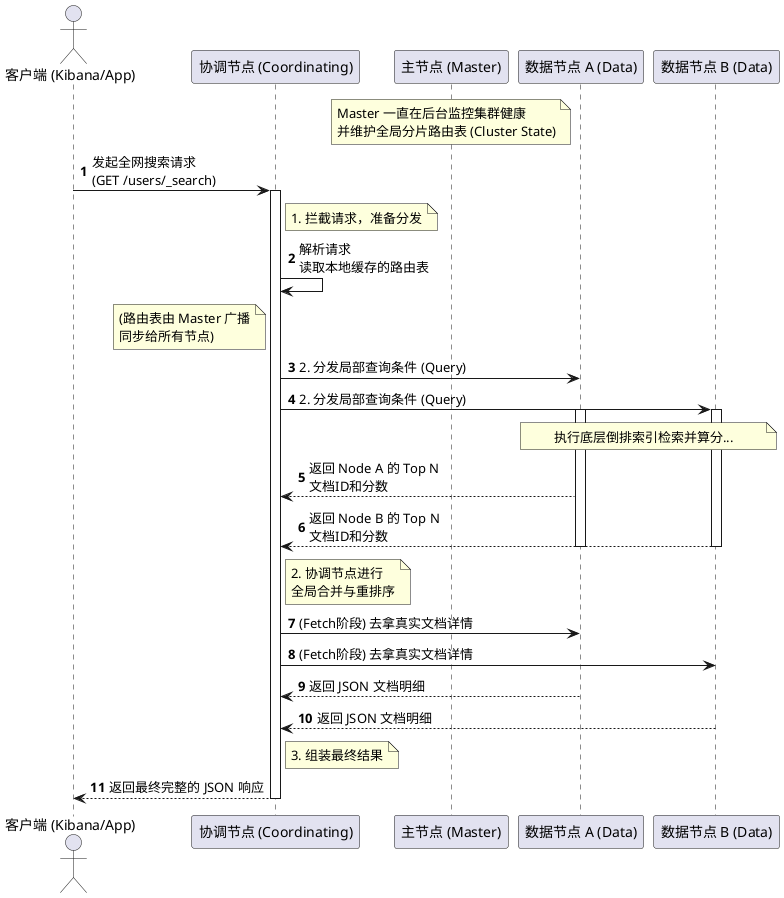
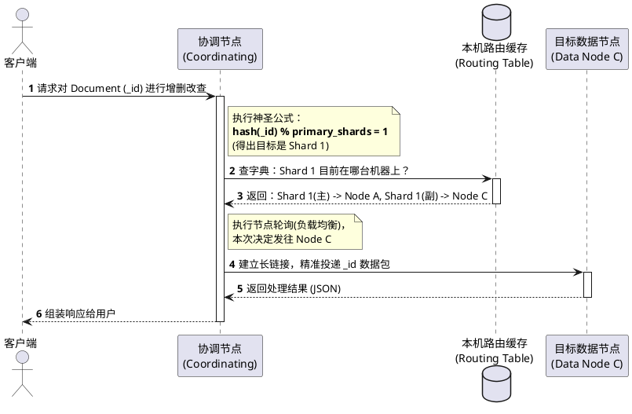
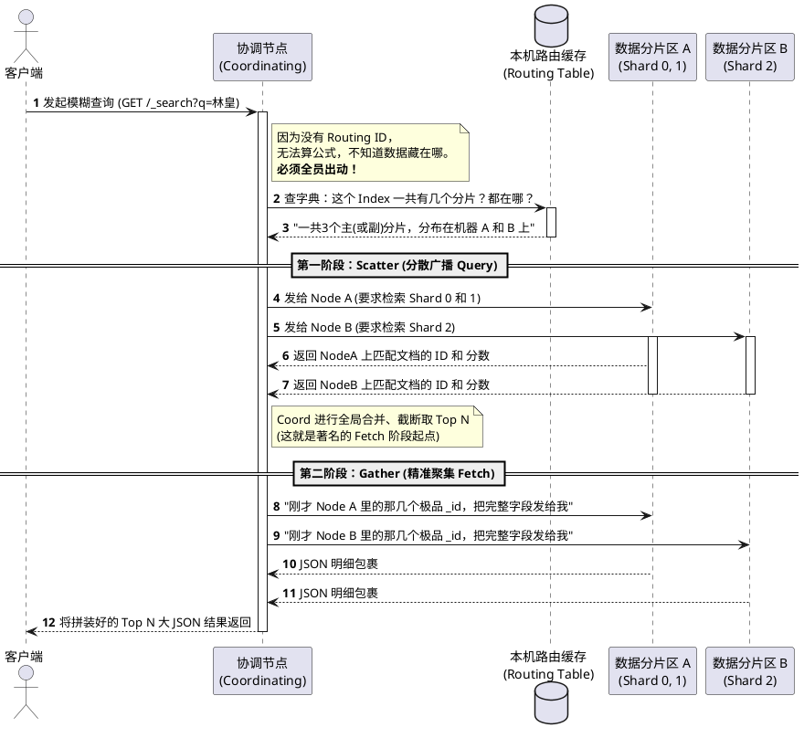

# 4. Elasticsearch Node（节点）核心解析

## 📑 目录

- [4. Elasticsearch Node（节点）核心解析](#4-elasticsearch-node节点核心解析)
  - [📑 目录](#-目录)
  - [一、什么是 Node？](#一什么是-node)
  - [二、Node 的核心角色与分工 (Roles)](#二node-的核心角色与分工-roles)
    - [1. `master` (主节点 / 候选主节点) —— **“公司的 CEO 与董事会”**](#1-master-主节点--候选主节点--公司的-ceo-与董事会)
    - [2. `data` (数据节点) —— **“公司的搬砖工与仓管”**](#2-data-数据节点--公司的搬砖工与仓管)
    - [3. `coordinating` (协调节点) —— **“公司的前台接待与项目经理”**](#3-coordinating-协调节点--公司的前台接待与项目经理)
    - [4. `ingest` (写入预处理节点) —— **“公司的安检员与加工厂”**](#4-ingest-写入预处理节点--公司的安检员与加工厂)
  - [三、架构关系图示 (PlantUML)](#三架构关系图示-plantuml)
  - [四、极简总结](#四极简总结)
  - [五、深水区探秘：Master 节点路由表运行原理](#五深水区探秘master-节点路由表运行原理)
    - [1. 发现与生成 (Generation)](#1-发现与生成-generation)
    - [2. 两阶段提交广播 (Publish \& Commit - 类似 Paxos/Raft)](#2-两阶段提交广播-publish--commit---类似-paxosraft)
    - [3. 当请求到来时：被动查询与精准路由 (Fetch \& Routing)](#3-当请求到来时被动查询与精准路由-fetch--routing)
    - [核心路由公式与精准投递流程](#核心路由公式与精准投递流程)
    - [模糊查询的路由流程：Scatter-Gather（分散-聚集）](#模糊查询的路由流程scatter-gather分散-聚集)

---

> 💡 **KISS 核心原则 (Keep It Simple, Stupid)**
> 在 Elasticsearch (ES) 中，你可以把整个集群（Cluster）想象成一个“公司”，而 **Node（节点）** 就是公司里的一名“员工”。一台启动了 ES 进程的服务器（或者容器）就是一个 Node。为了让公司高效运转，不同的员工（Node）会被分配不同的**角色（Role）**和**职责（Function）**。

---

## 一、什么是 Node？

*   **物理形态**：一台服务器上运行的一个 Elasticsearch 实例。
*   **组织归属**：任何一个 Node 在启动时，都会通过配置（如 `cluster.name`）加入到一个集群（Cluster）中。
*   **身份标识**：每个节点都有一个唯一的名字（`node.name`）和一个唯一的 UUID，以便集群互相识别。

---

## 二、Node 的核心角色与分工 (Roles)

在最新的 ES 版本体系中，节点角色由 `node.roles` 数组在配置文件（`elasticsearch.yml`）中精确定义。以下是 4 种最核心的“员工”角色：

### 1. `master` (主节点 / 候选主节点) —— **“公司的 CEO 与董事会”**
*   **核心功能**：负责集群层面的全局管控。它不负责处理具体的文档数据的读写。
*   **具体职责**：
    *   管理集群的元数据（Cluster State）。
    *   决定创建或删除哪个索引（Index）。
    *   决定将哪些分片（Shard）分配给哪些数据节点（Data Node）。
    *   监控其他节点的存活状态（加入或退出集群）。
*   **最佳实践**：为了高可用防止脑裂（Split-Brain），生产环境通常配置 3 个独立的、纯粹的候选主节点（配置为 `node.roles: [master]`），且尽量配置低延迟网络。

### 2. `data` (数据节点) —— **“公司的搬砖工与仓管”**
*   **核心功能**：真正负责保存数据（文档）以及执行与数据相关的重型操作。
*   **具体职责**：
    *   存储被分配到该节点上的分片（包含底层 Lucene 的倒排索引文件）。
    *   执行具体的 CRUD 操作（增删改查）。
    *   执行海量数据的搜索（Search）和聚合分析（Aggregations）运算。
*   **最佳实践**：由于承担繁重的 I/O 读写和 CPU 计算，该类节点极其消耗内存（JVM Heap）和磁盘（SSD）。生产环境建议将他们与 Master 节点分离配置（`node.roles: [data]`）。

### 3. `coordinating` (协调节点) —— **“公司的前台接待与项目经理”**
*   **核心功能**：本身不存数据，也不管大局，专门负责接收用户的 HTTP REST 请求，并将任务分发给其他节点，最后收集结果返回给用户。
*   **工作机制**：（这就是经典的 *Query Then Fetch* 流程）
    1.  收到客户端搜索请求。
    2.  将其路由/分发到包含相关数据的各个 Data Node。
    3.  等待 Data Node 返回局部结果。
    4.  在自己身上将各个局部结果进行“合并（Merge）”、“全局排序（Sort）”，最终组装成一段完整的 JSON 响应给客户端。
*   **最佳实践**：**每个节点默认都有协调能力**，但可以通过将 `roles` 设置为空数组（`node.roles: [ ]`）来强制让一台高配服务器成为专门的“纯协调节点”，做查询压力分流。

### 4. `ingest` (写入预处理节点) —— **“公司的安检员与加工厂”**
*   **核心功能**：在文档最终真正被写入 Data Node 并生成倒排索引之前，对其进行拦截、清洗和转换（类似于 Logstash 的轻量级过滤功能）。
*   **具体职责**：
    *   执行由用户预先定义好的 Pipeline（管道）和 Processors（处理器）。
    *   例如：在存入前将 IP 地址解析为地理位置（GeoIP）、转换时间格式、丢弃某些无用字段等。
*   **最佳实践**：如果你不想额外部署沉重的 Logstash，可以让特定的节点承担 `ingest` 角色（`node.roles: [ingest]`），负责写入前的数据“洗澡”。

---

## 三、架构关系图示 (PlantUML)

*基于 KISS 原则，我们使用最直观的 PlantUML 时序交互图，来展示一次完整的搜索请求中，这些不同角色的节点是如何高度协同配合的。*

## 四、极简总结
*   如果你的机器内存硬盘超级大 -> 用作 **`data`**。
*   如果需要稳定的大脑掌控全局索引生命周期 -> 抽干业务，独立设为 **`master`**。
*   如果前方的高并发查询组装压力巨大 -> 单设几台空集角色的服务器作为 **`coordinating`**。
*   如果是单机本地测试环境 -> 这个唯一的节点将同时扮演**所有角色**（既当爹又当妈）。

---

## 五、深水区探秘：Master 节点路由表运行原理

在刚才的时序图中，我们提到 Coordinating 节点并不是直接向 Master 去要数据，而是直接读“自己的本地路由表缓存”。这背后靠的就是 Elasticsearch 强大的 **集群状态 (Cluster State)** 广播机制。

> **路由表是什么？**
> 路由表（Routing Table）并非一张单独存在的纸，它是 **Cluster State（集群状态）** 这个无比核心的全局元数据大字典里的一个重要部分。它记录了：当前集群有哪些 Index，每个 Index 分了几个 Shard（主分片/副本分片），且这些 Shard 具体落在哪几台 Data Node 的 IP/端口上。

它的运行原理其实就 3 个核心步骤：

### 1. 发现与生成 (Generation)
*   **唯一决策者**：整个 ES 集群中，**有且仅有一台**被选举出的 Active Master 节点（活跃主节点）拥有修改 Cluster State 的权限。
*   在创建索引、删除索引、或者有 Data Node 宕机导致分片掉线时，Master 会立刻感知到这个大事件，并在自己的内存里计算出一份**最新的路由表**。

### 2. 两阶段提交广播 (Publish & Commit - 类似 Paxos/Raft)
Master 不能自己改完就算了，它必须确保前线的“作战单位”（所有的普通节点）手里的地图都是最新的。ES 会经历经典的 2PC（Two-Phase Commit）安全传播：
1.  **Publish（发布提议）**：Master 将这份最新的 Cluster State 打个包，广播发给集群内所有的节点。此时别的节点虽然收到了包裹，但是只把它存放起来，**不应用**。并向 Master 回复一个 ACK（已收到确认信）。
2.  **Commit（正式生效）**：当 Master 收到了**绝大多数（Quorum，通常是 `(主备数/2)+1`）**候选主节点的 ACK 时，它就认为这次发布是安全的。于是它发出第二道指令（Commit）。所有节点收到 Commit 后，瞬间把这份最新的路由表**覆盖刷入**自己的运行内存中。

### 3. 当请求到来时：被动查询与精准路由 (Fetch & Routing)
当我们的请求打到 Coordinating 节点时，它完全不需要跨越网络去烦扰 Master，直接去自己兜里掏出这个本地大字典，这也就是文档被路由（Routed）的过程。

> 🔍 **路由表里到底存了什么？**
> 把它想象成一本带层级的字典，它精确记录了集群数据的物理分布：
> 1.  **Index 级别**：集群里有哪些索引（如 `users_index`）。
> 2.  **Shard 级别**：这个索引被切成了几个主分片（如 `0, 1, 2`），分别有几个副本。
> 3.  **Node 级别映射**：最关键的，它记录了 `Shard 0 的 Primary` 目前存活在 `Node A (192.168.1.10)`，`Shard 0 的 Replica` 存活在 `Node B`。

### 核心路由公式与精准投递流程
Elasticsearch 之所以能做分布式的海量存储，且保证相同的文档每次都能被同一台节点找到，靠的就是 Coordinating 节点执行的一道神圣公式：
`shard_num = hash(_routing) % num_primary_shards`
*(默认情况下，`_routing` 的值就是这段数据的 `_id` 字段)*

下面这段 PlantUML 时序图，揭示了 Coordinating 节点使用上述公式和路由表时的毫秒级投递流程：

### 模糊查询的路由流程：Scatter-Gather（分散-聚集）
上方的流程叫“精准路由（Exact Routing）”，但其实大家在使用 ES 时，更多的是做**模糊匹配或全文检索**（比如搜 `name: "林皇"`），此时请求体里根本**没有 `_id` 供你做 Hash 计算**。

这种情况下，Coordinating 节点翻阅 Routing Table 后，会执行另一种被称为 **Scatter-Gather（分散-聚集）** 的史诗级并发捞取流程（这也完全契合了我们在第一章提到的 *Query Then Fetch* 概念）。

**精准 vs 模糊路由对比：**

| 查询类型 | 路由方式 | 比喻 | 性能特点 |
| :--- | :--- | :--- | :--- |
| 精确查询（带 `_id`） | `hash(_id) % shards` 定点投递 | 🎯 带锁头的狙击枪 | 极快，单节点直连 |
| 模糊查询（`match`） | Scatter-Gather 全分片广播 | 💥 无差别霰弹枪 | 较慢，但覆盖面全 |

> 💡 **本章核心一句话**
> Master 负责画地图（生成 Cluster State）并强行发给所有人（2PC），Coord 节点拿着这个常驻内存的地图，每次通过一条简单的 Hash 取模公式算出方位，然后照着地图“按图索骥”，完成超高速查询。无单点寻址瓶颈，这就是 Elasticsearch 搜索快如闪电的终极原因。
