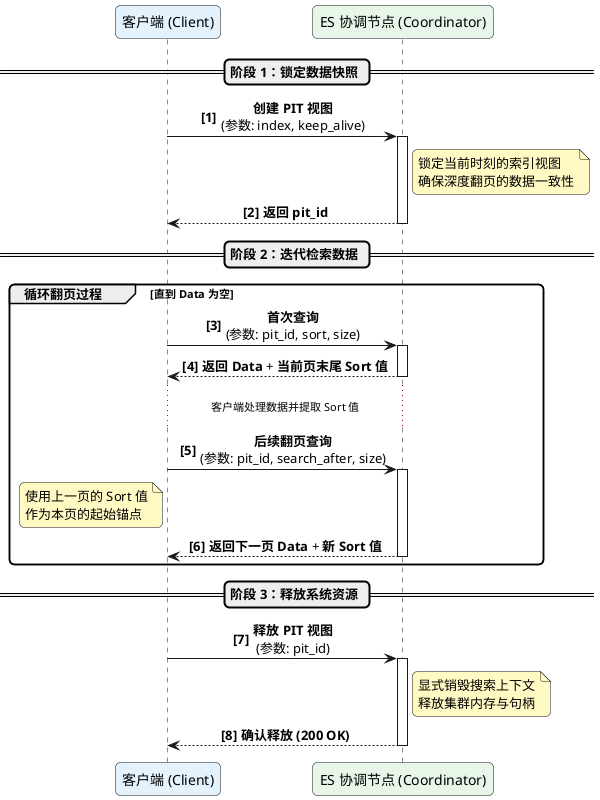

# Elasticsearch 分页方式深度解析

Elasticsearch (ES) 提供了多种数据分页方式，以满足从前端 UI 展示到大规模离线数据导出的不同业务需求。在 8.x 版本中，官方对分页机制进行了优化和规范。

## 📑 目录
- [1. from + size (浅分页)](#from-size)
- [2. scroll (快照分页 - 已废弃)](#scroll)
- [3. search_after (流式分页)](#search-after)
- [4. Point In Time (PIT) + search_after (深度分页标准方案)](#pit-search-after)
- [5. 总结与规避方案](#summary)

---

## 1. from + size (浅分页)

这是最基础、最直观的分页方式，类似于 SQL 中的 `LIMIT offset, count`。

*   **原理**：协调节点向所有分片请求前 `from + size` 条数据，然后在内存中进行全局排序，取出目标页。
*   **优点**：
    *   **实现简单**：直接在查询参数中指定即可。
    *   **支持随机跳页**：用户可以直接跳转到第 10 页。
*   **缺点**：
    *   **深度分页性能爆炸**：随着 `from` 增大，CPU 和内存消耗呈指数级增长（例如取第 10,000 条，每个分片都要选出前 10,000 条汇总，协调节点压力巨大）。
    *   **硬限制**：受 `index.max_result_window` 限制，默认最大值为 10,000条。
*   **适用场景**：前端 UI 展示，用户通常只翻看前几页。

---

## 2. scroll (快照分页 - 已废弃)

`scroll` API 会在搜索请求时创建一个数据的“快照”，并在指定时间内保持该状态。

*   **优点**：适合处理超大规模的数据导出，不依赖排序。
*   **缺点**：
    *   **非实时**：快照生成后的数据变更（增删改）无法反映在结果中。
    *   **资源密集**：需要在内存中维护沉重的搜索上下文。
    *   **官方弃用**：在 7.x 之后，官方明确建议使用 `search_after` + `PIT` 代替 `scroll`。
*   **适用场景**：旧系统维护或极低频率的大规模离线导出。

---

## 3. search_after (流式分页)

`search_after` 利用上一页最后一条数据的排序值（Sort Values）作为下一页的起始锚点。

*   **原理**：每次查询都携带上一次结果中最后一条记录的 `sort` 值。
*   **优点**：
    *   **无状态/高性能**：不需要像 `scroll` 那样维护庞大的上下文，适合高并发深度滚动。
    *   **无窗口限制**：可以突破 10,000 条的限制，一直向后翻页。
*   **缺点**：
    *   **不支持跳页**：只能顺序向后（或向前）翻页。
    *   **数据漂移风险**：如果在翻页期间有新数据插入且满足过滤条件，可能会导致数据重复或遗漏。
*   **适用场景**：社交媒体 Feed 流、实时日志流、无限滚动界面。

---

## 4. Point In Time (PIT) + search_after (深度分页标准方案)

这是 Elasticsearch 8.x 推荐的**处理一致性深度分页**和**数据导出**的最佳实践。

> **核心思路**：通过 PIT 锁定索引视图，解决 `search_after` 的数据漂移问题。

1.  **开启 PIT**：获取一个时间点视图标识。
2.  **迭代查询**：在查询中使用该 `pit_id`，并配合 `search_after` 实现稳定翻页。
3.  **释放资源**：手动删除 `pit` 以释放 ES 节点缓存。

---

## 5. 总结与规避方案

| 维度 | from + size | search_after | PIT + search_after |
| :--- | :--- | :--- | :--- |
| **8.x 推荐度** | 常用 (浅分页) | 推荐 (实时流) | **极力推荐 (深度/导出)** |
| **随机跳转** | 支持 | 不支持 | 不支持 |
| **一致性** | 弱 (实时变化) | 弱 (数据可能漂移) | **强 (固定时刻视图)** |
| **资源消耗** | 随深度增加 | 极低 | 中 (仅需维护轻量 PIT) |

### 🚀 如何规避缺点？

1.  **针对 from + size 的深度性能问题**：
    *   **业务截断**：在业务逻辑上限制最大翻页数（如 Google/百度搜索结果很少让你翻到 100 页之后）。
    *   **优化过滤条件**：引导用户使用更精确的关键词或时间范围，减小搜索窗口。
2.  **针对 search_after 的数据一致性问题**：
    *   **引入 PIT**：在 8.x 中，凡是涉及重要业务数据的深度分页（如审计、报表），务必配合 `pit` 参数。
3.  **针对 PIT 的资源占用问题**：
    *   **及时释放**：使用完毕后立即执行 `DELETE /_pit`。
    *   **合理设置 keep_alive**：不要设置过长的过期时间（如 `1h`），通常 `1m` 或 `5m` 足以支撑批处理。
