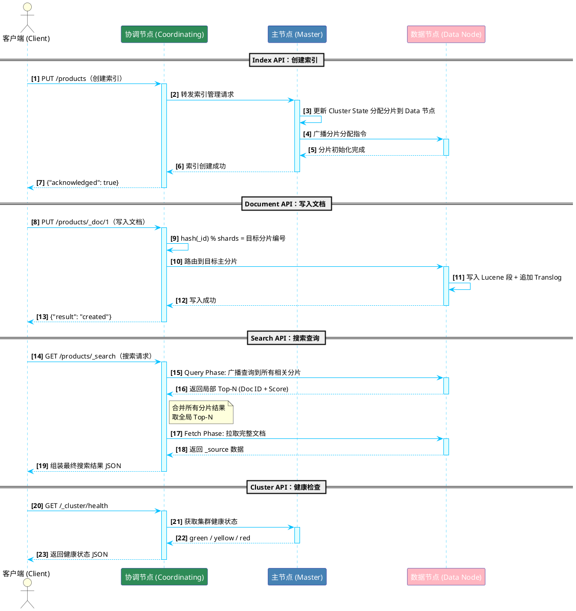

# Elasticsearch 核心 API 全面指南（RESTful 接口实战详解）

Elasticsearch 将所有功能通过 **RESTful HTTP API** 暴露出来，你与集群的一切交互——从建索引、写数据、搜文档到看集群状态——全部通过 HTTP 请求完成。本篇将系统梳理 ES 的 **五大核心 API 分类**，每个 API 都配有真实的请求/响应范例，帮你从"会用 Kibana 点按钮"升级到"闭眼手搓 DSL"。

> 💡 **通俗类比：**
> 如果 Elasticsearch 集群是一座巨大的智能图书馆，那么 API 就是图书馆的"服务窗口"——
> **Index API** 是"建馆 / 拆馆"窗口，**Document API** 是"借书 / 还书"窗口，
> **Search API** 是"全馆检索台"，**Cluster API** 是"馆长监控室"，**Analyze API** 是"文字拆解实验室"。

## 📑 目录

- [一、Index API（索引管理）](#index-api)
  - [1. 创建索引](#create-index)
  - [2. 查看索引](#get-index)
  - [3. 修改索引设置](#update-index-settings)
  - [4. 删除索引](#delete-index)
  - [5. 索引别名](#index-alias)
- [二、Document API（文档操作）](#document-api)
  - [1. 写入文档（Index/Create）](#index-doc)
  - [2. 获取文档（Get）](#get-doc)
  - [3. 更新文档（Update）](#update-doc)
  - [4. 删除文档（Delete）](#delete-doc)
  - [5. 批量操作（Bulk）](#bulk-api)
- [三、Search API（搜索查询）](#search-api)
  - [1. 基础搜索](#basic-search)
  - [2. Query DSL 核心语法](#query-dsl)
    - [2.1 `match` 全文匹配查询](#query-match)
    - [2.2 `term` 精确匹配查询](#query-term)
    - [2.3 `bool` 组合查询](#query-bool)
    - [2.4 `range` 范围查询](#query-range)
  - [3. 聚合查询（Aggregations）](#aggregations)
- [四、Cluster API（集群管理）](#cluster-api)
  - [1. 集群健康检查](#cluster-health)
  - [2. 集群状态查询](#cluster-state)
  - [3. _cat 系列 API](#cat-api)
- [五、Analyze API（分析器）](#analyze-api)
  - [1. _analyze 接口](#analyze-endpoint)
  - [2. 自定义分析器](#custom-analyzer)
- [六、核心 API 总结对比表](#api-summary-table)
- [七、API 请求生命周期全景图](#api-lifecycle)

---

<a id="index-api"></a>

## 一、Index API（索引管理）

Index API 负责 **索引的整个生命周期管理**——创建、查看、修改配置、删除，以及别名管理。它相当于关系型数据库里的 DDL（`CREATE TABLE`、`ALTER TABLE`、`DROP TABLE`）。

> 💡 **核心认知：**
> 在 Elasticsearch 中，**索引 (Index)** 不是 MySQL 里"给字段加的索引"，而是整张"数据表"本身。你先得有一个 Index，才能往里塞 Document。

<a id="create-index"></a>

### 1. 创建索引

- **关键端点**：`PUT /<index_name>`
- **核心功能**：创建一个新的索引，可同时指定 `settings`（分片与副本配置）和 `mappings`（字段类型定义）。

**【代码示例】创建一个带完整 Mapping 的商品索引**

```json
// 1. 使用 PUT 请求创建名为 products 的索引
PUT /products
{
  // 2. 设置分片与副本策略
  "settings": {
    "number_of_shards": 3,
    "number_of_replicas": 1
  },
  // 3. 声明字段映射规则（相当于 MySQL 的表结构定义）
  "mappings": {
    "properties": {
      "name":       { "type": "text", "analyzer": "ik_max_word" },
      "price":      { "type": "float" },
      "status":     { "type": "keyword" },
      "tags":       { "type": "keyword" },
      "created_at": { "type": "date", "format": "yyyy-MM-dd HH:mm:ss" }
    }
  }
}
```

- **使用场景**：生产环境中需要 **显式定义 Mapping**（字段类型、分词器），而不是依赖动态映射自动猜测。
- **注意事项**：
  - 索引名必须全部 **小写**，不能包含空格或特殊字符。
  - `number_of_shards` 创建后 **不可修改**，事前务必规划好。
  - 生产环境强烈建议显式 Mapping，避免动态映射把数字字符串误判为 `long`。

<a id="get-index"></a>

### 2. 查看索引

- **关键端点**：`GET /<index_name>`、`GET /<index_name>/_mapping`、`GET /<index_name>/_settings`

**【代码示例】查看索引的映射与配置**

```json
// 1. 获取索引的全部信息（settings + mappings + aliases）
GET /products

// 2. 只看字段映射规则
GET /products/_mapping

// 3. 只看索引配置（分片数、副本数、分析器等）
GET /products/_settings
```

- **使用场景**：排查字段类型不匹配导致搜索失败的问题；验证索引创建后的实际配置。

<a id="update-index-settings"></a>

### 3. 修改索引设置

- **关键端点**：`PUT /<index_name>/_settings`
- **核心功能**：动态修改索引的 **可变配置项**（如副本数、刷新间隔）。

**【代码示例】动态修改副本数与刷新间隔**

```json
// 1. 将副本数调整为 2（应对更高可用性需求）
PUT /products/_settings
{
  "index": {
    "number_of_replicas": 2
  }
}

// 2. 批量导入数据时，临时关闭自动刷新以提升写入性能
PUT /products/_settings
{
  "index": {
    "refresh_interval": "-1"
  }
}

// 3. 导入完成后，恢复默认 1 秒刷新
PUT /products/_settings
{
  "index": {
    "refresh_interval": "1s"
  }
}
```

- **注意事项**：只有 **动态设置**（如 `number_of_replicas`、`refresh_interval`）可以在线修改。**静态设置**（如 `number_of_shards`）需要重建索引。

<a id="delete-index"></a>

### 4. 删除索引

- **关键端点**：`DELETE /<index_name>`

**【代码示例】删除索引**

```json
// 1. 删除单个索引
DELETE /products

// 2. 通配符删除（极度危险！）
DELETE /log-2024-*
```

- **注意事项**：
  - 此操作 **不可逆**，所有数据将被永久删除。
  - 强烈建议在 `elasticsearch.yml` 中配置 `action.destructive_requires_name: true`，禁止通配符和 `_all` 删除，防止手抖灾难。

<a id="index-alias"></a>

### 5. 索引别名

- **关键端点**：`POST /_aliases`
- **核心功能**：给索引起一个"别名"，客户端通过别名访问，底层索引可以随时切换，实现 **零停机重建索引**。

**【代码示例】使用别名实现零停机索引切换**

```json
// 1. 给 products_v1 索引挂上别名 products
POST /_aliases
{
  "actions": [
    { "add": { "index": "products_v1", "alias": "products" } }
  ]
}

// 2. 新版索引 products_v2 准备好后，原子化切换别名
POST /_aliases
{
  "actions": [
    { "remove": { "index": "products_v1", "alias": "products" } },
    { "add":    { "index": "products_v2", "alias": "products" } }
  ]
}
```

- **使用场景**：蓝绿部署、索引版本升级、Mapping 变更后的无感迁移。
- **注意事项**：`actions` 数组中的操作是 **原子性** 的，要么全部成功，要么全部回滚，不会出现别名短暂消失的窗口期。

> 💡 **Index API 一句话总结：**
> Index API = SQL 里的 `CREATE TABLE` + `ALTER TABLE` + `DROP TABLE`。记住：索引一旦创建，主分片数就锁死了，所以 **先规划、再建索引**。

---

<a id="document-api"></a>

## 二、Document API（文档操作）

Document API 处理单个文档的 **增删改查 (CRUD)** 以及批量操作。它相当于 SQL 中的 `INSERT`、`SELECT`、`UPDATE`、`DELETE`，但操作对象是 JSON 文档。

> 💡 **核心认知：**
> Elasticsearch 中的文档是 **不可变的 (Immutable)**。所谓的"更新"，底层实际上是 **读取旧文档 → 修改 → 删除旧版本 → 写入新版本** 的过程。理解这一点，你就不会对 `_version` 字段的自增行为感到困惑了。

<a id="index-doc"></a>

### 1. 写入文档（Index/Create）

- **关键端点**：
  - `PUT /<index>/_doc/<id>` —— 指定 ID 写入，已存在则 **覆盖**（Upsert 语义）
  - `POST /<index>/_doc` —— 自动生成 ID
  - `PUT /<index>/_create/<id>` —— 仅创建，已存在则 **报错**

**【代码示例】三种写入方式对比**

```json
// 方式一：指定 _id = 1，如果已存在则全量覆盖（Upsert）
PUT /products/_doc/1
{
  "name": "iPhone 15 Pro",
  "price": 7999.00,
  "status": "on_sale",
  "tags": ["手机", "苹果"],
  "created_at": "2024-09-20 10:00:00"
}

// 方式二：不指定 _id，ES 自动生成一个唯一 ID
POST /products/_doc
{
  "name": "AirPods Pro 2",
  "price": 1899.00,
  "status": "on_sale"
}

// 方式三：仅创建，_id = 1 已存在时返回 409 Conflict 错误
PUT /products/_create/1
{
  "name": "iPhone 15 Pro",
  "price": 7999.00
}
```

- **注意事项**：
  - 使用 `PUT /_doc/<id>` 时要小心，它会 **全量替换** 整个文档，不是部分更新。
  - 生产环境高并发写入场景，可使用 `if_seq_no` + `if_primary_term` 实现 **乐观锁并发控制**。

<a id="get-doc"></a>

### 2. 获取文档（Get）

- **关键端点**：`GET /<index>/_doc/<id>`、`GET /<index>/_source/<id>`

**【代码示例】按 ID 获取文档**

```json
// 1. 获取完整文档（含元数据：_index, _id, _version, _source）
GET /products/_doc/1

// 2. 只获取文档内容，不要元数据包裹
GET /products/_source/1

// 3. 只返回指定字段（减少网络传输）
GET /products/_doc/1?_source_includes=name,price
```

- **使用场景**：已知文档 ID 的精确查找。注意：**Get API 是实时的**，不受 `refresh_interval` 影响，写入后立刻可读。

<a id="update-doc"></a>

### 3. 更新文档（Update）

- **关键端点**：`POST /<index>/_update/<id>`
- **核心功能**：支持 **部分字段更新**（`doc` 方式）和 **脚本更新**（`script` 方式）。

**【代码示例】两种更新方式**

```json
// 方式一：doc 部分更新 —— 只改 price 字段，其他字段保持不变
POST /products/_update/1
{
  "doc": {
    "price": 6999.00
  }
}

// 方式二：script 脚本更新 —— 价格减去指定折扣
POST /products/_update/1
{
  "script": {
    "source": "ctx._source.price -= params.discount",
    "params": {
      "discount": 500
    }
  }
}

// 方式三：upsert —— 文档存在则更新，不存在则用 upsert 内容创建
POST /products/_update/1
{
  "doc": {
    "price": 6999.00
  },
  "upsert": {
    "name": "iPhone 15 Pro",
    "price": 6999.00,
    "status": "on_sale"
  }
}
```

- **注意事项**：
  - `_update` 底层仍然是 **删旧写新**，但它比 `PUT /_doc` 更智能——如果内容没变化（`detect_noop: true`，默认开启），它不会触发重新索引。
  - `script` 更新适合计数器递增、库存扣减等原子操作场景。

<a id="delete-doc"></a>

### 4. 删除文档（Delete）

- **关键端点**：`DELETE /<index>/_doc/<id>`

**【代码示例】按 ID 删除文档**

```json
// 1. 删除指定 ID 的文档
DELETE /products/_doc/1

// 2. 按条件批量删除（Delete By Query）
POST /products/_delete_by_query
{
  "query": {
    "term": {
      "status": "off_sale"
    }
  }
}
```

- **注意事项**：删除操作是 **软删除**——文档被标记为已删除并增加版本号，实际磁盘空间在后台 **段合并 (Segment Merge)** 时才会被回收。

<a id="bulk-api"></a>

### 5. 批量操作（Bulk）

- **关键端点**：`POST /_bulk`、`POST /<index>/_bulk`
- **核心功能**：将多个 `index`、`create`、`update`、`delete` 操作合并到一次 HTTP 请求中，大幅减少网络往返开销。

**【代码示例】Bulk 批量混合操作**

```json
// 注意：每一行必须是独立的一行 JSON（NDJSON 格式），不能有换行美化
POST /_bulk
{ "index": { "_index": "products", "_id": "1" } }
{ "name": "iPhone 15 Pro", "price": 7999.00, "status": "on_sale" }
{ "index": { "_index": "products", "_id": "2" } }
{ "name": "AirPods Pro 2", "price": 1899.00, "status": "on_sale" }
{ "update": { "_index": "products", "_id": "1" } }
{ "doc": { "price": 6999.00 } }
{ "delete": { "_index": "products", "_id": "3" } }
```

- **使用场景**：数据迁移、ETL 批量导入、日志批量写入。
- **注意事项**：
  - Bulk 请求体使用 **NDJSON 格式**（每行一个 JSON），不是标准 JSON 数组。
  - 单次 Bulk 建议控制在 **5~15 MB**，过大会占用过多内存。
  - Bulk 中的每个操作是 **独立计算成败** 的——某一条失败不会导致其他操作回滚。

> 💡 **为什么 Bulk 用 NDJSON 而不是 JSON 数组？**
> 因为 NDJSON 允许 ES 逐行 **流式解析**，不需要把整个请求体一次性加载到内存里做 JSON 反序列化。对于动辄几万条的批量操作，这能节省大量内存。

---

<a id="search-api"></a>

## 三、Search API（搜索查询）

Search API 是 Elasticsearch 的 **皇冠明珠**——`_search` 端点配合 Query DSL，提供了全文检索、结构化过滤和聚合分析三大能力。如果你用 ES 只是当 MySQL 的替代品做 CRUD，那真是暴殄天物了。

> 💡 **核心认知：**
> ES 的搜索走的是 **Query Then Fetch** 两阶段流程（详见 elastic1.md）。第一阶段在所有分片上跑查询拿到 Doc ID + Score，第二阶段到对应分片上拉取完整文档。理解这个流程，你就知道为什么 `from + size` 深分页会爆内存了。

<a id="basic-search"></a>

### 1. 基础搜索

- **关键端点**：`GET /<index>/_search`、`POST /<index>/_search`

**【代码示例】最简搜索请求与响应结构解析**

```json
// 1. 搜索 products 索引，返回价格降序的前 10 条，只要 name 和 price 字段
GET /products/_search
{
  "query": {
    "match_all": {}
  },
  "size": 10,
  "from": 0,
  "sort": [
    { "price": "desc" }
  ],
  "_source": ["name", "price"]
}
```

- **响应结构关键字段**：
  - `took` —— 查询耗时（毫秒）
  - `hits.total.value` —— 命中文档总数
  - `hits.hits[]` —— 命中的文档数组
  - `hits.hits[]._score` —— 每个文档的相关性评分
  - `hits.hits[]._source` —— 文档原始内容

<a id="query-dsl"></a>

### 2. Query DSL 核心语法

Query DSL 是 ES 搜索的灵魂语言，以下是四种最高频的查询类型：

<a id="query-match"></a>

#### 2.1 `match` —— 全文匹配查询

- **核心功能**：将查询字符串先经过 **分词器分词**，再去倒排索引中匹配，适用于 `text` 类型字段。

**【代码示例】match 全文搜索**

```json
// 搜索商品名包含"苹果"或"手机"的文档（分词后是 OR 逻辑）
GET /products/_search
{
  "query": {
    "match": {
      "name": "苹果手机"
    }
  }
}

// 要求所有分词必须同时匹配（AND 逻辑）
GET /products/_search
{
  "query": {
    "match": {
      "name": {
        "query": "苹果手机",
        "operator": "and"
      }
    }
  }
}
```

<a id="query-term"></a>

#### 2.2 `term` —— 精确匹配查询

- **核心功能**：对查询值 **不做分词**，直接拿原始值去匹配，适用于 `keyword`、`integer`、`boolean` 等精确值字段。

**【代码示例】term 精确查询**

```json
// 精确匹配状态为 "on_sale" 的商品
GET /products/_search
{
  "query": {
    "term": {
      "status": {
        "value": "on_sale"
      }
    }
  }
}
```

- **注意事项**：**绝对不要** 在 `text` 字段上使用 `term` 查询！`text` 字段的值已经被分词器拆成了小写 token，你拿原始值去匹配肯定查不到。

<a id="query-bool"></a>

#### 2.3 `bool` —— 组合查询

- **核心功能**：通过 `must`（必须匹配）、`should`（应该匹配）、`must_not`（必须不匹配）、`filter`（过滤，不算分）四种子句组合多个查询条件。

**【代码示例】bool 复合查询（电商场景：搜手机 + 价格过滤 + 排除下架）**

```json
GET /products/_search
{
  "query": {
    "bool": {
      // 1. must：必须匹配，参与算分
      "must": [
        { "match": { "name": "手机" } }
      ],
      // 2. filter：必须匹配，但不算分，且结果可缓存
      "filter": [
        { "range": { "price": { "gte": 3000, "lte": 8000 } } }
      ],
      // 3. must_not：必须不匹配
      "must_not": [
        { "term": { "status": "off_sale" } }
      ],
      // 4. should：可选匹配，命中则加分
      "should": [
        { "term": { "tags": "旗舰" } }
      ]
    }
  }
}
```

> 💡 **`must` vs `filter` —— 理解算分与不算分的区别：**
> 把 `must` 想象成老师给作文 **打分**——匹配得好分数就高（影响 `_score` 排序）。
> 把 `filter` 想象成门卫 **查身份证**——合格就放行、不合格就拦住，不存在"分数"概念，而且查过的结果会被 **缓存** 起来，下次来不用再查。
> **经验法则**：日期范围、状态过滤、ID 匹配这类"是或否"的条件，永远放 `filter` 里。

<a id="query-range"></a>

#### 2.4 `range` —— 范围查询

- **核心功能**：对数值、日期等类型做范围过滤，支持 `gt`、`gte`、`lt`、`lte`。

**【代码示例】range 范围查询**

```json
// 1. 数值范围：价格在 3000~8000 之间
GET /products/_search
{
  "query": {
    "range": {
      "price": {
        "gte": 3000,
        "lte": 8000
      }
    }
  }
}

// 2. 时间范围：2024 年全年的数据
GET /products/_search
{
  "query": {
    "range": {
      "created_at": {
        "gte": "2024-01-01 00:00:00",
        "lt": "2025-01-01 00:00:00",
        "format": "yyyy-MM-dd HH:mm:ss"
      }
    }
  }
}
```

<a id="aggregations"></a>

### 3. 聚合查询（Aggregations）

- **核心功能**：ES 内置的 **实时分析引擎**，相当于 SQL 中的 `GROUP BY` + `COUNT` + `AVG` + `SUM`，但更强大——支持分桶嵌套、管道计算等高级玩法。

聚合分为三大类：

- **Bucket Aggregation（分桶聚合）**：按条件分组，如 `terms`（按字段值分桶）、`date_histogram`（按时间间隔分桶）
- **Metric Aggregation（指标聚合）**：对分桶内的数据做数学计算，如 `avg`、`sum`、`max`、`min`、`stats`
- **Pipeline Aggregation（管道聚合）**：基于其他聚合的结果再做二次计算，如 `avg_bucket`

**【代码示例】按状态分桶 + 计算每桶平均价格（嵌套聚合）**

```json
// 1. size: 0 表示不返回文档命中，只要聚合结果
GET /products/_search
{
  "size": 0,
  "aggs": {
    // 2. 第一层：按 status 字段值分桶
    "group_by_status": {
      "terms": {
        "field": "status"
      },
      // 3. 第二层：在每个桶内计算平均价格
      "aggs": {
        "avg_price": {
          "avg": {
            "field": "price"
          }
        }
      }
    }
  }
}
```

**【代码示例】按月统计销售趋势（date_histogram）**

```json
GET /products/_search
{
  "size": 0,
  "aggs": {
    "monthly_trend": {
      "date_histogram": {
        "field": "created_at",
        "calendar_interval": "month",
        "format": "yyyy-MM"
      },
      "aggs": {
        "total_sales": {
          "sum": { "field": "price" }
        }
      }
    }
  }
}
```

- **使用场景**：数据看板 (Dashboard)、实时报表、Kibana 可视化的底层数据源。
- **注意事项**：
  - 聚合只能在 `keyword` 或数值类型字段上执行，`text` 字段默认无法聚合（除非开启 `fielddata`，但这会 **吃爆内存**）。
  - 高基数 (High Cardinality) 的 `terms` 聚合要关注 `shard_size` 参数调优，否则结果可能不精确。

---

<a id="cluster-api"></a>

## 四、Cluster API（集群管理）

Cluster API 提供集群级别的 **运维可观测性**——健康状态、节点信息、分片分配等。它是 DevOps 和 SRE 工程师的"仪表盘"。

> 💡 **通俗类比：**
> 如果 Index API 和 Document API 是"业务侧窗口"，那 Cluster API 就是"馆长办公室的监控大屏"——你不用它也能正常借书还书，但出了问题没它你就是瞎子。

<a id="cluster-health"></a>

### 1. 集群健康检查

- **关键端点**：`GET /_cluster/health`、`GET /_cluster/health/<index>`
- **核心功能**：一键查看集群的整体健康状态。

**【代码示例】集群健康检查**

```json
// 1. 查看整个集群的健康状态
GET /_cluster/health

// 2. 只查看某个索引的健康状态
GET /_cluster/health/products
```

- **三种状态含义**：
  - 🟢 `green` —— 所有主分片和副本分片均已分配，集群完全健康
  - 🟡 `yellow` —— 所有主分片已分配，但部分副本分片未分配（单节点开发环境常见，因为副本不会分配到与主分片相同的节点上）
  - 🔴 `red` —— 存在主分片未分配，**有数据丢失风险**，需要立即排查
- **使用场景**：监控脚本轮询、部署后健康检查、告警触发条件。

<a id="cluster-state"></a>

### 2. 集群状态查询

- **关键端点**：`GET /_cluster/state`、`GET /_cluster/stats`、`GET /_nodes/stats`

**【代码示例】集群状态与节点信息查询**

```json
// 1. 获取完整集群状态（数据量很大，生产慎用）
GET /_cluster/state

// 2. 只获取路由表信息（按需过滤）
GET /_cluster/state/routing_table

// 3. 获取集群统计摘要（索引数、文档数、存储大小等）
GET /_cluster/stats

// 4. 获取所有节点的运行时指标（JVM、OS、线程池等）
GET /_nodes/stats
```

- **注意事项**：`_cluster/state` 返回的是 **完整的 Cluster State**，数据量可能非常大。生产环境建议用 **metric 过滤器**（如 `routing_table`、`metadata`、`nodes`）按需获取。

<a id="cat-api"></a>

### 3. _cat 系列 API

- **关键端点**：`GET /_cat/<endpoint>?v`
- **核心功能**：以 **人类可读的表格格式** 输出集群信息，加上 `?v` 参数可以显示列标题。

**【代码示例】常用 _cat 命令速查表**

```text
GET /_cat/indices?v           // 查看所有索引及其状态、文档数、存储大小
GET /_cat/nodes?v             // 查看所有节点及其 IP、角色、资源占用
GET /_cat/shards?v            // 查看分片分配情况（哪个分片在哪个节点上）
GET /_cat/health?v            // 一行式集群健康摘要
GET /_cat/allocation?v        // 查看各节点的磁盘使用与分片分配
GET /_cat/thread_pool?v       // 查看线程池队列状态（排查写入/搜索队列积压）
GET /_cat/recovery?v          // 查看正在进行的分片恢复进度
GET /_cat/pending_tasks?v     // 查看 Master 节点待处理的集群任务队列
```

- **使用场景**：SSH 登录服务器后快速诊断集群问题，不需要 Kibana 也能一目了然。
- **注意事项**：`_cat` API 是给 **人看的**，返回的是纯文本表格。如果需要程序化处理，请使用对应的 JSON 接口（如 `_cluster/health`、`_nodes/stats`）。

> 💡 **一句话记忆：**
> `_cat` 就是 Elasticsearch 版的 `top` / `htop` 命令——快速、直观、一眼扫完全局状态。

---

<a id="analyze-api"></a>

## 五、Analyze API（分析器）

Analyze API 让你能够 **测试和调试文本分词效果**，这对于理解搜索结果的相关性至关重要。当你发现"明明写入了这个文档，但搜不到"的时候，第一反应就应该是用 `_analyze` 看看分词器到底把你的文本拆成了什么样。

> 💡 **核心认知：**
> Elasticsearch 搜索的底层逻辑是 **"你的查询词被分词后的 token"去匹配"文档字段被分词后的 token"**。如果两边用的分词器不一致，或者分词结果对不上，搜索就会失败。`_analyze` 就是帮你透视这个"拆词"过程的 X 光机。

<a id="analyze-endpoint"></a>

### 1. _analyze 接口

- **关键端点**：`GET /_analyze`、`POST /_analyze`、`POST /<index>/_analyze`

**【代码示例】测试不同分析器的分词效果**

```json
// 1. 使用标准分析器 (standard) 对英文进行分词
POST /_analyze
{
  "analyzer": "standard",
  "text": "Elasticsearch is a distributed search engine"
}
// 返回 tokens: ["elasticsearch", "is", "a", "distributed", "search", "engine"]

// 2. 使用 IK 中文分词器（ik_max_word 最大粒度切分）
POST /_analyze
{
  "analyzer": "ik_max_word",
  "text": "中华人民共和国国歌"
}
// 返回 tokens: ["中华人民共和国", "中华人民", "中华", "华人", "人民共和国", "人民", "共和国", "共和", "国歌"]

// 3. 使用 IK 智能模式（ik_smart 最粗粒度切分）
POST /_analyze
{
  "analyzer": "ik_smart",
  "text": "中华人民共和国国歌"
}
// 返回 tokens: ["中华人民共和国", "国歌"]

// 4. 按某个索引中某个字段的已配置分析器来分词
POST /products/_analyze
{
  "field": "name",
  "text": "苹果 iPhone 15 Pro Max"
}
```

- **使用场景**：排查搜索不到预期文档的原因；对比 `ik_max_word` 与 `ik_smart` 的分词差异；验证 IK 自定义词典是否生效。

<a id="custom-analyzer"></a>

### 2. 自定义分析器

- **核心功能**：一个 Analyzer 由三部分组成：`char_filter`（字符过滤器）→ `tokenizer`（分词器）→ `filter`（Token 过滤器）。你可以自由组合出满足业务需求的分析管道。

**【代码示例】创建包含自定义分析器的索引**

```json
PUT /my_custom_index
{
  "settings": {
    "analysis": {
      // 1. 定义自定义停用词过滤器
      "filter": {
        "my_stopwords": {
          "type": "stop",
          "stopwords": ["的", "了", "是", "在", "和"]
        }
      },
      // 2. 组装自定义分析器
      "analyzer": {
        "my_chinese_analyzer": {
          "type": "custom",
          "tokenizer": "ik_max_word",
          "filter": ["lowercase", "my_stopwords"]
        }
      }
    }
  },
  // 3. 在 Mapping 中使用自定义分析器
  "mappings": {
    "properties": {
      "content": {
        "type": "text",
        "analyzer": "my_chinese_analyzer"
      }
    }
  }
}
```

- **注意事项**：
  - 自定义分析器属于 **静态配置**，只能在 **索引创建时** 定义。修改已有分析器需要关闭索引 (`POST /my_index/_close`) 或重建索引。
  - 可以通过 `search_analyzer` 给搜索阶段指定不同的分析器（写入用 `ik_max_word` 最大粒度，搜索用 `ik_smart` 最小粒度，是常见的中文搜索优化手段）。

---

<a id="api-summary-table"></a>

## 六、核心 API 总结对比表

| API 类别 | 核心端点 | HTTP 方法 | 类比 (SQL) | 典型使用场景 | 关键注意事项 |
| :--- | :--- | :--- | :--- | :--- | :--- |
| **Index API** | `PUT /<index>` | PUT / DELETE / GET | `CREATE TABLE` / `DROP TABLE` | 索引生命周期管理、别名切换 | 主分片数创建后不可更改 |
| **Document API** | `PUT /<index>/_doc/<id>` | PUT / POST / GET / DELETE | `INSERT` / `SELECT` / `UPDATE` / `DELETE` | 文档 CRUD 与批量导入 | Bulk 建议 5~15 MB 批次 |
| **Search API** | `GET /<index>/_search` | GET / POST | `SELECT ... WHERE ... GROUP BY` | 全文搜索、结构化过滤、聚合分析 | `filter` 不算分且可缓存 |
| **Cluster API** | `GET /_cluster/health` | GET | `SHOW STATUS` | 集群监控与运维诊断 | `_cat` 仅供人阅读，程序用 JSON 接口 |
| **Analyze API** | `POST /_analyze` | GET / POST | N/A | 分词调试与搜索相关性调优 | 自定义分析器为静态配置 |

---

<a id="api-lifecycle"></a>

## 七、API 请求生命周期全景图

下面这张时序图将五大 API 的典型请求流程串联起来，展示客户端请求如何经过 **协调节点** 调度，最终由 **主节点** 或 **数据节点** 处理并返回结果。



这张图的核心要点：

1. **所有请求先到协调节点**：客户端不需要知道数据在哪个分片上，协调节点负责路由和结果聚合。
2. **Index API 走主节点**：涉及集群元数据变更的操作（创建/删除索引）需要 Master 节点处理。
3. **Document API 走数据节点**：协调节点通过 `hash(_id) % number_of_shards` 公式精准路由到目标分片。
4. **Search API 分两阶段**：Query Phase 广播查询收集 ID + Score，Fetch Phase 按需拉取完整文档。
5. **Cluster API 走主节点**：集群状态信息由 Master 节点维护和分发。
