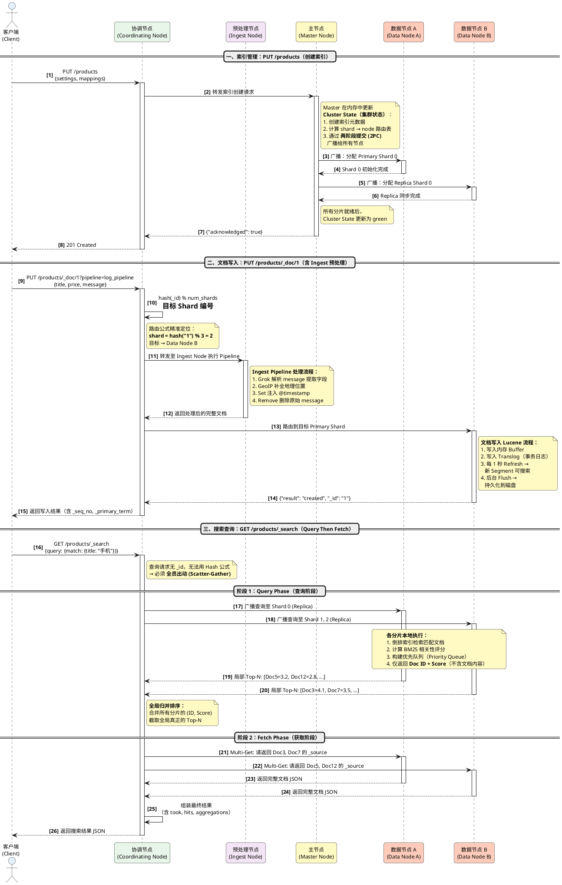

# Elasticsearch 核心 API 完全指南

> Elasticsearch 的所有功能都通过 **RESTful HTTP API** 暴露。无论是建索引、写文档、搜数据还是管集群，一次 HTTP 请求搞定一切。本文将系统梳理 ES 的 **核心 API**，按功能域分类，每个 API 配真实示例。

> 💡 **通俗类比：** 如果 ES 集群是一座智能图书馆——
> **Index API** 是"建馆/拆馆窗口"，**Document API** 是"借还书窗口"，
> **Search API** 是"全馆检索台"，**Cat API** 是"LED 状态大屏"，
> **Ingest API** 是"入库安检流水线"，**Snapshot API** 是"全馆备份档案室"。

## 📑 目录

- [一、索引操作 API（Index API）](#一索引操作-apiindex-api)
  - [1.1 创建索引](#11-创建索引)
  - [1.2 查看索引信息](#12-查看索引信息)
  - [1.3 修改索引设置](#13-修改索引设置)
  - [1.4 删除索引](#14-删除索引)
  - [1.5 索引别名](#15-索引别名)
  - [1.6 打开/关闭索引](#16-打开关闭索引)
- [二、文档操作 API（Document API）](#二文档操作-apidocument-api)
  - [2.1 写入文档](#21-写入文档)
  - [2.2 获取文档](#22-获取文档)
  - [2.3 更新文档](#23-更新文档)
  - [2.4 删除文档](#24-删除文档)
  - [2.5 批量操作 Bulk](#25-批量操作-bulk)
  - [2.6 批量获取 Multi-Get](#26-批量获取-multi-get)
  - [2.7 按条件删除 Delete By Query](#27-按条件删除-delete-by-query)
  - [2.8 按条件更新 Update By Query](#28-按条件更新-update-by-query)
- [三、搜索与查询 API（Search API）](#三搜索与查询-apisearch-api)
  - [3.1 基础搜索](#31-基础搜索)
  - [3.2 URI Search（简易搜索）](#32-uri-search简易搜索)
  - [3.3 全文检索查询](#33-全文检索查询)
  - [3.4 精确值查询](#34-精确值查询)
  - [3.5 组合查询 Bool Query](#35-组合查询-bool-query)
  - [3.6 范围查询](#36-范围查询)
  - [3.7 聚合查询 Aggregations](#37-聚合查询-aggregations)
  - [3.8 高亮查询](#38-高亮查询)
  - [3.9 搜索建议 Suggesters](#39-搜索建议-suggesters)
  - [3.10 多索引搜索 Multi-Search](#310-多索引搜索-multi-search)
  - [3.11 计数 API Count](#311-计数-api-count)
  - [3.12 验证查询 Validate](#312-验证查询-validate)
- [四、映射与分析 API（Mapping & Analyze API）](#四映射与分析-apimapping--analyze-api)
  - [4.1 查看与定义映射](#41-查看与定义映射)
  - [4.2 新增字段映射](#42-新增字段映射)
  - [4.3 分词测试 Analyze](#43-分词测试-analyze)
  - [4.4 自定义分析器](#44-自定义分析器)
- [五、数据预处理 API（Ingest API）](#五数据预处理-apiingest-api)
  - [5.1 创建管道 Pipeline](#51-创建管道-pipeline)
  - [5.2 内置处理器速览](#52-内置处理器速览)
  - [5.3 模拟测试管道](#53-模拟测试管道)
- [六、索引模板 API（Index Template API）](#六索引模板-apiindex-template-api)
  - [6.1 组件模板](#61-组件模板)
  - [6.2 可组合索引模板](#62-可组合索引模板)
- [七、数据迁移 API（Reindex API）](#七数据迁移-apireindex-api)
  - [7.1 基础 Reindex](#71-基础-reindex)
  - [7.2 远程 Reindex](#72-远程-reindex)
  - [7.3 异步执行与进度查看](#73-异步执行与进度查看)
- [八、快照与恢复 API（Snapshot & Restore API）](#八快照与恢复-apisnapshot--restore-api)
  - [8.1 注册仓库](#81-注册仓库)
  - [8.2 创建快照](#82-创建快照)
  - [8.3 恢复快照](#83-恢复快照)
  - [8.4 管理快照](#84-管理快照)
- [九、深度分页 API（PIT & Search After）](#九深度分页-api点时间点-api)
  - [9.1 Point In Time](#91-point-in-time)
  - [9.2 Search After](#92-search-after)
- [十、集群管理 API（Cluster API）](#十集群管理-apicluster-api)
  - [10.1 集群健康](#101-集群健康)
  - [10.2 集群状态与统计](#102-集群状态与统计)
  - [10.3 节点信息](#103-节点信息)
  - [10.4 分片管理](#104-分片管理)
- [十一、Cat API（轻量级信息查看）](#十一cat-api轻量级信息查看)
  - [11.1 常用 Cat 命令](#111-常用-cat-命令)
- [十二、核心 API 全景速查表](#十二核心-api-全景速查表)
- [十三、API 请求生命周期全景图](#十三api-请求生命周期全景图)

---

## 一、索引操作 API（Index API）

索引是 ES 中数据的顶层容器，相当于关系型数据库中的"表"。Index API 负责索引的完整生命周期管理——创建、查看、修改、删除、别名控制。

### 1.1 创建索引

**端点：** `PUT /<index_name>`

创建索引时可以同时指定分片副本策略和字段映射。

```json
// 创建索引：指定 settings + mappings
PUT /products
{
  "settings": {
    "number_of_shards": 3,
    "number_of_replicas": 1
  },
  "mappings": {
    "properties": {
      "title":      { "type": "text", "analyzer": "ik_max_word" },
      "price":      { "type": "double" },
      "category":   { "type": "keyword" },
      "is_active":  { "type": "boolean" },
      "created_at": { "type": "date" }
    }
  }
}
```

- **注意：** `number_of_shards` 创建后不可更改，需提前规划。

### 1.2 查看索引信息

```json
GET /products                      // 查看索引全部信息
GET /products/_mapping              // 仅查看字段映射
GET /products/_settings             // 仅查看配置
GET /products/_alias                // 查看别名
GET /_all                          // 查看所有索引摘要
```

### 1.3 修改索引设置

**端点：** `PUT /<index>/_settings`

```json
// 动态修改副本数
PUT /products/_settings
{
  "index": { "number_of_replicas": 2 }
}

// 批量导入时临时关闭自动刷新（提升写入速度）
PUT /products/_settings
{
  "index": { "refresh_interval": "-1" }
}

// 导入完毕后恢复
PUT /products/_settings
{
  "index": { "refresh_interval": "1s" }
}
```

### 1.4 删除索引

```json
DELETE /products                   // 删除单个索引（不可逆！）
DELETE /log-2024-*                 // 通配符删除（极度危险）
```

### 1.5 索引别名

**端点：** `POST /_aliases`

别名是索引的"软链接"，实现零停机索引切换。

```json
// 为 products_v1 添加别名 products
POST /_aliases
{
  "actions": [
    { "add": { "index": "products_v1", "alias": "products" } }
  ]
}

// 原子化切换：v1 → v2
POST /_aliases
{
  "actions": [
    { "remove": { "index": "products_v1", "alias": "products" } },
    { "add":    { "index": "products_v2", "alias": "products" } }
  ]
}

// 之后通过别名访问：GET /products/_search
```

### 1.6 打开/关闭索引

```json
POST /products/_close              // 关闭索引（释放内存，不可读写）
POST /products/_open               // 重新打开
```

---

## 二、文档操作 API（Document API）

文档是 ES 中的最小数据单元，以 JSON 格式存储。Document API 提供完整的 CRUD 能力。

### 2.1 写入文档

ES 提供三种写入语义，灵活应对不同场景：

```json
// 方式一：PUT 指定 ID，存在则全量覆盖
PUT /products/_doc/1
{ "title": "MacBook Pro", "price": 14999, "category": "电脑" }

// 方式二：POST 自动生成 ID
POST /products/_doc
{ "title": "AirPods Pro", "price": 1899, "category": "耳机" }

// 方式三：PUT + _create，存在则报 409 冲突
PUT /products/_create/1
{ "title": "MacBook Pro", "price": 14999 }
```

### 2.2 获取文档

```json
GET /products/_doc/1                       // 完整文档（含元数据）
GET /products/_source/1                    // 只要文档本体，不要元数据
GET /products/_doc/1?_source=title,price   // 只返回指定字段
GET /products/_doc/1?_stored_fields=title  // 只取 stored 字段
```

### 2.3 更新文档

**端点：** `POST /<index>/_update/<id>`

支持部分更新和脚本更新：

```json
// doc 方式：部分更新（只改 price，其他字段不动）
POST /products/_update/1
{ "doc": { "price": 13999 } }

// script 方式：脚本更新（库存减 1）
POST /products/_update/1
{
  "script": {
    "source": "ctx._source.stock -= params.qty",
    "params": { "qty": 1 }
  }
}

// upsert：存在则更新，不存在则创建
POST /products/_update/99
{
  "doc": { "price": 999 },
  "upsert": { "title": "新商品", "price": 999, "category": "默认" }
}
```

### 2.4 删除文档

```json
DELETE /products/_doc/1                    // 按 ID 删除
```

### 2.5 批量操作 Bulk

**端点：** `POST /_bulk` 或 `POST /<index>/_bulk`

将多条 index / create / update / delete 合并为一次 HTTP 请求。使用 **NDJSON 格式**（每行一个 JSON，非标准 JSON 数组）。

```json
POST /_bulk
{"index": {"_index": "products", "_id": "1"}}
{"title": "iPhone 15", "price": 7999}
{"index": {"_index": "products", "_id": "2"}}
{"title": "iPad Air", "price": 4799}
{"update": {"_index": "products", "_id": "1"}}
{"doc": {"price": 7499}}
{"delete": {"_index": "products", "_id": "2"}}
```

- **注意：** 单次 Bulk 建议控制在 **5~15 MB**，各操作独立成败。

### 2.6 批量获取 Multi-Get

**端点：** `GET /_mget` 或 `GET /<index>/_mget`

```json
GET /products/_mget
{
  "ids": ["1", "2", "3"]
}

// 跨索引批量获取
GET /_mget
{
  "docs": [
    { "_index": "products", "_id": "1" },
    { "_index": "orders",   "_id": "100" }
  ]
}
```

### 2.7 按条件删除 Delete By Query

**端点：** `POST /<index>/_delete_by_query`

```json
// 删除所有 status 为 off_sale 的商品
POST /products/_delete_by_query
{
  "query": { "term": { "status": "off_sale" } }
}

// 带版本冲突处理的异步删除
POST /products/_delete_by_query?conflicts=proceed&wait_for_completion=false
{
  "query": { "range": { "created_at": { "lt": "2023-01-01" } } }
}
```

### 2.8 按条件更新 Update By Query

**端点：** `POST /<index>/_update_by_query`

```json
// 给所有满足条件的文档增加一个字段
POST /products/_update_by_query
{
  "query": { "term": { "category": "手机" } },
  "script": {
    "source": "ctx._source.discount = 0.9",
    "lang": "painless"
  }
}
```

---

## 三、搜索与查询 API（Search API）

Search API 是 ES 最强大的能力。通过 `_search` 端点配合 Query DSL，支持全文检索、精确过滤、聚合分析、高亮建议等。

### 3.1 基础搜索

```json
GET /products/_search
{
  "query": { "match_all": {} },
  "size": 10,
  "from": 0,
  "sort": [{ "price": "desc" }],
  "_source": ["title", "price"]
}
```

**响应结构关键字段：**

| 字段 | 含义 |
|------|------|
| `took` | 查询耗时（毫秒） |
| `hits.total.value` | 命中文档总数 |
| `hits.hits[]` | 命中的文档数组 |
| `hits.max_score` | 最高相关性评分 |
| `hits.hits[]._score` | 单条文档评分 |
| `hits.hits[]._source` | 文档原始内容 |

### 3.2 URI Search（简易搜索）

直接在 URL 中传入查询条件，适合快速调试：

```text
GET /products/_search?q=title:手机                    // 简易查询
GET /products/_search?q=category:手机 AND price:<8000  // 带条件
GET /products/_search?q=title:(手机 OR 电脑)            // OR 逻辑
GET /_all/_search?q=title:手机                         // 全索引搜索
```

### 3.3 全文检索查询

全文检索查询会对查询文本 **先分词再匹配**，适用于 `text` 类型字段。

#### `match` —— 基础全文匹配

```json
// OR 逻辑（默认）：包含"手机"或"苹果"都算命中
GET /products/_search
{ "query": { "match": { "title": "苹果手机" } } }

// AND 逻辑：必须同时包含
GET /products/_search
{
  "query": {
    "match": {
      "title": {
        "query": "苹果手机",
        "operator": "and"
      }
    }
  }
}
```

#### `match_phrase` —— 短语匹配

要求分词后的 token **必须相邻且顺序一致**。

```json
// 精确匹配"深度学习"这个短语（拆成"深度"+"学习"且必须紧挨着出现）
GET /articles/_search
{
  "query": {
    "match_phrase": {
      "content": "深度学习"
    }
  }
}
```

#### `multi_match` —— 多字段匹配

同时在多个字段上搜索同一个关键词。

```json
GET /products/_search
{
  "query": {
    "multi_match": {
      "query": "蓝牙耳机",
      "fields": ["title^3", "description"],  // title 权重是 description 的 3 倍
      "type": "best_fields"
    }
  }
}
```

#### `query_string` —— 高级查询语法

支持 AND、OR、NOT、通配符等复杂查询语法。

```json
GET /products/_search
{
  "query": {
    "query_string": {
      "query": "(title:手机 OR title:电脑) AND price:[3000 TO 10000] AND NOT status:off_sale",
      "default_field": "title"
    }
  }
}
```

### 3.4 精确值查询

精确查询 **不做分词**，直接拿原始值匹配，适用于 `keyword`、`integer`、`boolean`、`date` 等类型。

#### `term` —— 精确匹配

```json
GET /products/_search
{
  "query": { "term": { "status": "on_sale" } }
}
```

- **致命陷阱：** 绝对不要对 `text` 字段使用 `term`！`text` 字段的值已被分词器转成小写 token，你拿原始值去匹配大概率查不到。

#### `terms` —— 多值精确匹配（类似 SQL 的 IN）

```json
// 查找分类为"手机"或"电脑"或"平板"的商品
GET /products/_search
{
  "query": {
    "terms": {
      "category": ["手机", "电脑", "平板"]
    }
  }
}
```

#### `exists` —— 字段是否存在

```json
GET /products/_search
{
  "query": {
    "exists": { "field": "description" }
  }
}
```

#### `ids` —— 按文档 ID 查询

```json
GET /products/_search
{
  "query": {
    "ids": { "values": ["1", "2", "3"] }
  }
}
```

#### `wildcard` —— 通配符查询

```json
// 查找以 "elastic" 开头的字段值
GET /products/_search
{
  "query": {
    "wildcard": {
      "title": {
        "value": "elastic*",
        "case_insensitive": true
      }
    }
  }
}
```

- **注意：** 通配符查询性能较差，以 `*` 开头尤其消耗资源，应谨慎使用。

#### `regexp` —— 正则查询

```json
GET /products/_search
{
  "query": {
    "regexp": {
      "product_code": {
        "value": "SKU-[0-9]{4}-[A-Z]{2}"
      }
    }
  }
}
```

### 3.5 组合查询 Bool Query

`bool` 是 ES 查询的"万能胶水"，通过四种子句灵活组合：

| 子句 | 语义 | 是否参与算分 | 是否缓存 |
|------|------|:---:|:---:|
| `must` | 必须匹配 | ✅ | ❌ |
| `should` | 应该匹配（命中加分） | ✅ | ❌ |
| `must_not` | 必须不匹配 | ❌ | ❌ |
| `filter` | 过滤条件 | ❌ | ✅ |

```json
GET /products/_search
{
  "query": {
    "bool": {
      "must": [
        { "match": { "title": "手机" } }
      ],
      "filter": [
        { "range": { "price": { "gte": 3000, "lte": 8000 } } },
        { "term": { "is_active": true } }
      ],
      "must_not": [
        { "term": { "category": "配件" } }
      ],
      "should": [
        { "term": { "tags": "旗舰" } },
        { "term": { "tags": "新品" } }
      ],
      "minimum_should_match": 0
    }
  }
}
```

> 💡 **`must` vs `filter` 的本质区别：**
> `must` 像老师给作文打分——匹配得好分数高，影响排序。
> `filter` 像门卫查身份证——合格放行、不合格拦住，无分数概念，且结果会被缓存复用。
> **经验法则：** 日期范围、状态判断、ID 过滤等"是/否"条件永远放 `filter`。

### 3.6 范围查询

```json
// 数值范围
GET /products/_search
{
  "query": {
    "range": { "price": { "gte": 3000, "lte": 8000 } }
  }
}

// 日期范围（支持 Date Math 日期数学运算）
GET /orders/_search
{
  "query": {
    "range": {
      "created_at": {
        "gte": "now-7d/d",      // 7 天前的零点
        "lte": "now"
      }
    }
  }
}
```

### 3.7 聚合查询 Aggregations

聚合是 ES 的 **实时分析引擎**，功能远超 SQL 的 `GROUP BY`。分为三大类：

- **Bucket（分桶）：** 按条件分组（`terms`、`date_histogram`、`range` 等）
- **Metric（指标）：** 数学统计（`avg`、`sum`、`max`、`min`、`stats`、`cardinality` 等）
- **Pipeline（管道）：** 基于其他聚合结果再计算（`derivative`、`moving_avg` 等）

#### 按字段值分桶 + 指标统计

```json
// 按商品分类分桶，统计每类的平均价格和商品数量
GET /products/_search
{
  "size": 0,
  "aggs": {
    "by_category": {
      "terms": { "field": "category" },
      "aggs": {
        "avg_price": { "avg": { "field": "price" } },
        "count":     { "value_count": { "field": "_id" } }
      }
    }
  }
}
```

#### 按时间间隔分桶（时间趋势）

```json
// 按月统计订单总金额
GET /orders/_search
{
  "size": 0,
  "aggs": {
    "monthly_sales": {
      "date_histogram": {
        "field": "created_at",
        "calendar_interval": "month",
        "format": "yyyy-MM"
      },
      "aggs": {
        "total_amount": { "sum": { "field": "amount" } }
      }
    }
  }
}
```

#### 嵌套聚合（多级下钻）

```json
// 先按品牌分桶 → 再按分类分桶 → 最后统计平均价格
GET /products/_search
{
  "size": 0,
  "aggs": {
    "by_brand": {
      "terms": { "field": "brand" },
      "aggs": {
        "by_category": {
          "terms": { "field": "category" },
          "aggs": {
            "avg_price": { "avg": { "field": "price" } }
          }
        }
      }
    }
  }
}
```

#### 基数去重统计（UV 计算）

```json
// 统计有多少个不同的用户下了单
GET /orders/_search
{
  "size": 0,
  "aggs": {
    "unique_users": {
      "cardinality": { "field": "user_id" }
    }
  }
}
```

### 3.8 高亮查询

让搜索结果中的匹配关键词以 HTML 标签包裹，方便前端标红。

```json
GET /products/_search
{
  "query": { "match": { "title": "蓝牙耳机" } },
  "highlight": {
    "fields": {
      "title": {
        "pre_tags": ["<em class='hl'>"],
        "post_tags": ["</em>"]
      }
    }
  }
}
// 响应中会多出 "highlight" 字段：
// "highlight": { "title": ["<em class='hl'>蓝牙耳机</em> 无线降噪版"] }
```

### 3.9 搜索建议 Suggesters

#### Term Suggester —— 纠错建议

```json
GET /products/_search
{
  "suggest": {
    "my_suggestion": {
      "text": "iphne",
      "term": {
        "field": "title",
        "suggest_mode": "popular"
      }
    }
  }
}
// 可能返回：["iphone", "phone"]
```

#### Completion Suggester —— 自动补全

需要字段类型为 `completion`，基于内存中的 FST 结构实现极速前缀匹配。

```json
GET /products/_search
{
  "suggest": {
    "product_suggest": {
      "prefix": "Mac",
      "completion": {
        "field": "title_suggest",
        "size": 5
      }
    }
  }
}
// 返回：["MacBook Pro", "MacBook Air", "Mac mini", "iMac", ...]
```

#### Phrase Suggester —— 短语纠错

```json
GET /products/_search
{
  "suggest": {
    "phrase_suggest": {
      "text": "lptop cmputer",
      "phrase": {
        "field": "title",
        "max_errors": 2,
        "confidence": 0.5
      }
    }
  }
}
// 可能返回：["laptop computer"]
```

### 3.10 多索引搜索 Multi-Search

**端点：** `POST /_msearch`

在单次 HTTP 请求中并行执行多个搜索查询，使用 NDJSON 格式。

```json
POST /_msearch
{"index": "products"}
{"query": {"match": {"title": "手机"}}, "size": 3}
{"index": "orders"}
{"query": {"range": {"amount": {"gte": 1000}}}, "size": 3}
{"index": "users"}
{"query": {"match": {"name": "张三"}}, "size": 3}
```

- 各查询独立成败，某个失败不影响其他。

### 3.11 计数 API Count

快速获取满足条件的文档总数，不需要返回具体文档内容。

```json
GET /products/_count
{
  "query": { "term": { "status": "on_sale" } }
}
// 返回：{"count": 1234}
```

### 3.12 验证查询 Validate

测试查询 DSL 是否合法，不实际执行搜索。

```json
GET /products/_validate/query?explain
{
  "query": {
    "match": { "title": "手机" }
  }
}
// 返回：{"valid": true, "explanations": [...]}
```

---

## 四、映射与分析 API（Mapping & Analyze API）

### 4.1 查看与定义映射

```json
// 查看映射
GET /products/_mapping

// 创建索引时定义映射
PUT /products
{
  "mappings": {
    "properties": {
      "title": { "type": "text", "fields": { "keyword": { "type": "keyword" } } },
      "price": { "type": "scaled_float", "scaling_factor": 100 }
    }
  }
}
```

### 4.2 新增字段映射

**端点：** `PUT /<index>/_mapping`

已有索引可以 **新增字段**，但不能修改已有字段的类型。

```json
// 新增一个 tags 字段
PUT /products/_mapping
{
  "properties": {
    "tags": { "type": "keyword" },
    "location": { "type": "geo_point" }
  }
}
```

### 4.3 分词测试 Analyze

**端点：** `POST /_analyze`

调试文本分词效果，是排查搜索问题的第一工具。

```json
// 测试标准分析器
POST /_analyze
{
  "analyzer": "standard",
  "text": "Elasticsearch is powerful"
}
// tokens: ["elasticsearch", "is", "powerful"]

// 测试 IK 中文分词（最大粒度）
POST /_analyze
{
  "analyzer": "ik_max_word",
  "text": "中华人民共和国"
}
// tokens: ["中华人民共和国", "中华人民", "中华", "华人", "人民共和国", "人民", "共和国", "共和", "国"]

// 测试 IK 智能分词（最粗粒度）
POST /_analyze
{
  "analyzer": "ik_smart",
  "text": "中华人民共和国"
}
// tokens: ["中华人民共和国"]

// 使用索引字段上已配置的分析器测试
POST /products/_analyze
{
  "field": "title",
  "text": "苹果蓝牙耳机"
}
```

### 4.4 自定义分析器

分析器由三部分组成：`char_filter` → `tokenizer` → `token filter`。

```json
PUT /my_index
{
  "settings": {
    "analysis": {
      "char_filter": {
        "my_char_filter": {
          "type": "html_strip"
        }
      },
      "filter": {
        "my_stopwords": {
          "type": "stop",
          "stopwords": ["的", "了", "是"]
        }
      },
      "analyzer": {
        "my_analyzer": {
          "type": "custom",
          "char_filter": ["my_char_filter"],
          "tokenizer": "ik_max_word",
          "filter": ["lowercase", "my_stopwords"]
        }
      }
    }
  },
  "mappings": {
    "properties": {
      "content": {
        "type": "text",
        "analyzer": "my_analyzer",
        "search_analyzer": "ik_smart"
      }
    }
  }
}
```

- **注意：** 自定义分析器是 **静态配置**，只能在索引创建时定义。写入用 `ik_max_word`（最大粒度），搜索用 `ik_smart`（智能粒度），是中文搜索的常见优化手段。

---

## 五、数据预处理 API（Ingest API）

Ingest Pipeline 是 ES 内置的轻量级 ETL 引擎。文档在写入 Data Node 之前，先经过 Ingest Node 预处理——无需额外部署 Logstash。

### 5.1 创建管道 Pipeline

```json
// 创建 Pipeline：日志写入前自动解析并补全字段
PUT /_ingest/pipeline/log_pipeline
{
  "description": "解析访问日志并注入时间戳",
  "processors": [
    {
      "grok": {
        "field": "message",
        "patterns": ["%{IP:client_ip} %{WORD:method} %{URIPATH:path} %{NUMBER:status:int}"]
      }
    },
    {
      "geoip": {
        "field": "client_ip",
        "target_field": "geo"
      }
    },
    {
      "remove": {
        "field": "message"
      }
    },
    {
      "set": {
        "field": "@timestamp",
        "value": "{{_ingest.timestamp}}"
      }
    }
  ]
}

// 写入时指定 Pipeline
POST /access_logs/_doc?pipeline=log_pipeline
{
  "message": "192.168.1.1 GET /api/users 200"
}
```

### 5.2 内置处理器速览

| Processor | 功能 | 示例场景 |
|:---|:---|:---|
| `set` | 设置字段值 | 注入时间戳、默认值 |
| `remove` | 删除字段 | 脱敏处理 |
| `rename` | 重命名字段 | 字段名规范化 |
| `convert` | 类型转换 | 字符串 → 整数 |
| `grok` | 正则提取结构化数据 | 解析 Nginx/Apache 日志 |
| `date` | 日期解析与格式化 | 统一时间格式 |
| `geoip` | IP → 地理位置 | 访问日志地理分析 |
| `script` | 执行 Painless 脚本 | 自定义复杂逻辑 |
| `lowercase` / `uppercase` | 大小写转换 | 数据规范化 |
| `split` | 分隔符拆分为数组 | 标签字符串拆分 |
| `pipeline` | 嵌套调用其他 Pipeline | 复用已有管道 |

### 5.3 模拟测试管道

用 `_simulate` 端点测试 Pipeline 处理效果，不上传真实数据。

```json
POST /_ingest/pipeline/log_pipeline/_simulate
{
  "docs": [
    { "_source": { "message": "10.0.0.1 POST /api/login 401" } }
  ]
}
// 返回处理后的完整文档结构，方便调试
```

---

## 六、索引模板 API（Index Template API）

为匹配命名模式的索引自动注入预定义的 settings 和 mappings。

### 6.1 组件模板

可复用的配置积木块：

```json
// 组件模板：日志通用 Settings
PUT /_component_template/logs_settings
{
  "template": {
    "settings": {
      "number_of_shards": 3,
      "number_of_replicas": 1,
      "refresh_interval": "5s"
    }
  }
}

// 组件模板：日志通用 Mappings
PUT /_component_template/logs_mappings
{
  "template": {
    "mappings": {
      "properties": {
        "@timestamp": { "type": "date" },
        "level":      { "type": "keyword" },
        "message":    { "type": "text" },
        "service":    { "type": "keyword" }
      }
    }
  }
}
```

### 6.2 可组合索引模板

```json
// 匹配 log-* 模式，组装两个组件模板
PUT /_index_template/logs_template
{
  "index_patterns": ["log-*"],
  "composed_of": ["logs_settings", "logs_mappings"],
  "priority": 100,
  "template": {
    "aliases": { "all_logs": {} }
  }
}

// 之后创建 log-2024-09-20 时自动应用模板
PUT /log-2024-09-20
```

---

## 七、数据迁移 API（Reindex API）

### 7.1 基础 Reindex

**端点：** `POST /_reindex`

```json
POST /_reindex
{
  "source": { "index": "products_v1" },
  "dest":   { "index": "products_v2" }
}
```

### 7.2 远程 Reindex

从另一个 ES 集群直接拉数据。

```json
POST /_reindex
{
  "source": {
    "remote": {
      "host": "https://old-cluster:9200",
      "username": "admin",
      "password": "secret"
    },
    "index": "products"
  },
  "dest": { "index": "products_migrated" }
}
```

### 7.3 异步执行与进度查看

大数据量 Reindex 使用异步模式，通过 `_tasks` API 查看进度。

```json
// 异步执行
POST /_reindex?wait_for_completion=false
{
  "source": { "index": "products_v1", "size": 5000 },
  "dest":   { "index": "products_v2" }
}
// 返回 task_id

// 查看进度
GET /_tasks/<task_id>

// 取消任务
POST /_tasks/<task_id>/_cancel
```

---

## 八、快照与恢复 API（Snapshot & Restore API）

### 8.1 注册仓库

```json
// 本地文件系统仓库
PUT /_snapshot/my_backup
{
  "type": "fs",
  "settings": { "location": "/data/es_backup" }
}

// S3 仓库
PUT /_snapshot/s3_backup
{
  "type": "s3",
  "settings": { "bucket": "my-backup", "region": "us-east-1" }
}
```

### 8.2 创建快照

```json
PUT /_snapshot/my_backup/snap_20240920
{
  "indices": "products,orders",
  "ignore_unavailable": true,
  "include_global_state": false
}

// 查看快照进度
GET /_snapshot/my_backup/snap_20240920/_status
```

### 8.3 恢复快照

```json
POST /_snapshot/my_backup/snap_20240920/_restore
{
  "indices": "products",
  "include_global_state": false,
  "rename_pattern": "products",
  "rename_replacement": "products_restored"
}
```

### 8.4 管理快照

```json
GET /_snapshot/my_backup/_all                    // 列出所有快照
DELETE /_snapshot/my_backup/snap_20240901         // 删除旧快照
POST /_snapshot/my_backup/snap_20240920/_status   // 查看状态
```

---

## 九、深度分页 API（时间点 API）

### 9.1 Point In Time

创建索引的只读一致性快照视图，解决翻页期间数据漂移问题。

```json
// 创建 PIT（keep_alive 控制存活时间）
POST /orders/_search/pit?keep_alive=5m
// 返回 pit_id

// 搜索时使用 PIT
GET /_search
{
  "pit": {
    "id": "my_pit_id",
    "keep_alive": "5m"
  },
  "query": { "match_all": {} },
  "size": 100,
  "sort": [{ "created_at": "asc" }, { "_shard_doc": "asc" }]
}

// 释放 PIT（重要！）
DELETE /_pit
{ "id": "my_pit_id" }
```

### 9.2 Search After

基于排序值翻页，突破 10000 条深度分页限制。

```json
// 第一页
GET /_search
{
  "query": { "match_all": {} },
  "size": 100,
  "sort": [{ "created_at": "asc" }, { "_shard_doc": "asc" }]
}

// 第二页（用上一页最后一条的 sort 值作为 search_after）
GET /_search
{
  "query": { "match_all": {} },
  "size": 100,
  "sort": [{ "created_at": "asc" }, { "_shard_doc": "asc" }],
  "search_after": ["2024-09-20T10:00:00", 42]
}
```

> 💡 **PIT + `search_after` 是 ES 8.x 深度分页的官方推荐方案**，已取代 `scroll` API。

---

## 十、集群管理 API（Cluster API）

### 10.1 集群健康

```json
GET /_cluster/health                    // 整体健康
GET /_cluster/health?level=shards       // 含分片级别详情
GET /_cluster/health/products           // 指定索引健康
```

| 状态 | 含义 |
|:---:|------|
| 🟢 `green` | 所有主分片 + 副本分片均已分配，完全健康 |
| 🟡 `yellow` | 主分片正常，部分副本未分配（单节点环境常见） |
| 🔴 `red` | 存在主分片未分配，有数据丢失风险 |

### 10.2 集群状态与统计

```json
GET /_cluster/state                     // 完整集群状态（数据量大，慎用）
GET /_cluster/state/routing_table       // 仅路由表
GET /_cluster/stats                     // 集群统计摘要（索引数、文档数、存储量）
```

### 10.3 节点信息

```json
GET /_nodes                             // 所有节点信息
GET /_nodes/stats                       // 节点运行时指标（JVM、OS、线程池）
GET /_nodes/<node_id>/stats/jvm         // 指定节点的 JVM 指标
GET /_nodes/<node_id>/stats/thread_pool // 指定节点的线程池指标
```

### 10.4 分片管理

```json
GET /_cat/shards?v                      // 查看分片分配情况
POST /_cluster/reroute                  // 手动迁移分片
{
  "commands": [
    {
      "move": {
        "index": "products",
        "shard": 0,
        "from_node": "node_a",
        "to_node": "node_b"
      }
    }
  ]
}
```

---

## 十一、Cat API（轻量级信息查看）

Cat API 以 **人类可读的表格格式** 输出信息，是 SSH 登录服务器快速诊断的利器。

### 11.1 常用 Cat 命令

```text
GET /_cat/indices?v              // 所有索引：状态、文档数、存储大小
GET /_cat/nodes?v                // 所有节点：IP、角色、磁盘/内存占用
GET /_cat/shards?v               // 分片分配：哪个分片在哪个节点
GET /_cat/shards/products?v      // 指定索引的分片分配
GET /_cat/health?v               // 一行式健康摘要
GET /_cat/allocation?v           // 各节点磁盘使用率
GET /_cat/thread_pool?v          // 线程池队列状态（排查积压）
GET /_cat/recovery?v             // 分片恢复进度
GET /_cat/pending_tasks?v        // Master 待处理任务
GET /_cat/aliases?v              // 索引别名列表
GET /_cat/fielddata?v            // 字段数据缓存占用
GET /_cat/plugins?v              // 已安装插件列表
```

> 💡 **`_cat` 是给"人"看的工具**（纯文本表格），程序化处理请用 JSON 接口（`GET /_cat/indices?format=json`）。

---

## 十二、核心 API 全景速查表

| API 类别 | 核心端点 | 功能 | SQL 类比 | 注意事项 |
|:---|:---|:---|:---|:---|
| **Index** | `PUT /<index>` | 创建/查看/修改/删除索引 | DDL | 主分片数不可改 |
| **Document** | `PUT /<index>/_doc/<id>` | 单文档 CRUD | DML | Bulk 建议每批 5~15 MB |
| **Multi-Get** | `GET /<index>/_mget` | 批量按 ID 获取 | `SELECT WHERE id IN (...)` | 跨索引可用 `_mget` |
| **Bulk** | `POST /_bulk` | 批量增删改 | 批量 DML | NDJSON 格式 |
| **Delete By Query** | `POST /<index>/_delete_by_query` | 按条件批量删除 | `DELETE WHERE ...` | 异步执行，注意版本冲突 |
| **Update By Query** | `POST /<index>/_update_by_query` | 按条件批量更新 | `UPDATE SET ... WHERE ...` | 可配合脚本 |
| **Search** | `GET /<index>/_search` | 全文搜索 + 聚合 | `SELECT + GROUP BY` | `filter` 不算分且可缓存 |
| **Multi-Search** | `POST /_msearch` | 批量搜索 | 多个 SELECT | NDJSON 格式 |
| **Count** | `GET /<index>/_count` | 计数 | `SELECT COUNT(*)` | 比 search 更轻量 |
| **Validate** | `GET /<index>/_validate/query` | 验证查询合法性 | — | 不实际执行搜索 |
| **Mapping** | `GET /<index>/_mapping` | 查看与定义字段结构 | Schema | 已有字段不可改类型 |
| **Analyze** | `POST /_analyze` | 测试分词效果 | — | 排查搜索问题的第一工具 |
| **Ingest** | `PUT /_ingest/pipeline/<name>` | 写入前预处理 | ETL 触发器 | 用 `_simulate` 测试 |
| **Index Template** | `PUT /_index_template/<name>` | 索引自动模板 | DDL 模板 | 仅对新建索引生效 |
| **Reindex** | `POST /_reindex` | 跨索引数据迁移 | `INSERT INTO ... SELECT` | 大数据量异步执行 |
| **Snapshot** | `PUT /_snapshot/<repo>/<snap>` | 备份与恢复 | `mysqldump` | 增量快照，需先注册仓库 |
| **PIT** | `POST /<index>/_search/pit` | 一致性时间点快照 | 事务隔离快照 | 必须手动释放 |
| **Cluster** | `GET /_cluster/health` | 集群健康与状态 | `SHOW STATUS` | `_cluster/state` 数据量大 |
| **Cat** | `GET /_cat/<endpoint>?v` | 人类可读表格 | `top` / `htop` | 仅给人看，程序用 JSON |

---

## 十三、API 请求生命周期全景图

下面这张时序图将文档写入、搜索查询、索引管理三大典型 API 请求流程串联起来，展示客户端请求如何经过 **协调节点 (Coordinating Node)** 调度，最终由 **主节点 (Master Node)** 或 **数据节点 (Data Node)** 处理并返回结果的完整生命周期。



### 流程核心要点

1. **所有请求先到协调节点**
   客户端只需要知道集群中任意一个节点的地址。协调节点负责解析请求、路由分发和结果聚合——客户端完全不需要关心数据在哪个分片上。

2. **索引管理走主节点**
   创建索引、删除索引、更新映射等涉及 **集群元数据 (Cluster State)** 变更的操作，必须由 Master 节点统一决策。Master 通过 **两阶段提交 (2PC)** 将变更安全广播给所有节点。

3. **文档写入可走 Ingest 预处理**
   如果请求带有 `pipeline` 参数，协调节点会先将文档转发到 Ingest Node 执行预处理（Grok 解析、GeoIP 补全、字段转换等），处理完成后再路由到目标分片。不配 Pipeline 则跳过此步骤。

4. **文档写入走数据节点（精准路由）**
   协调节点通过 `hash(_id) % number_of_shards` 公式精准计算出目标分片编号，然后查阅本地缓存的路由表找到分片所在的 Data Node，直接投递。**单节点直连，速度极快。**

5. **搜索走所有分片（Scatter-Gather）**
   搜索请求没有 `_id` 可供 Hash 计算，必须 **广播到所有相关分片**。每个分片在本地执行倒排索引检索并返回局部 Top-N（仅 Doc ID + Score），协调节点汇总后做全局归并排序，最后到对应分片拉取完整文档内容。这就是经典的 **Query Then Fetch** 两阶段流程。

6. **搜索性能优化要点**

| 优化策略 | 原理 | 适用场景 |
|:---|:---|:---|
| 用 `filter` 替代 `must` | 不算分 + 结果缓存 | 状态过滤、日期范围、ID 匹配 |
| 用 `_source` 过滤字段 | 减少网络传输数据量 | 只需展示部分字段 |
| 控制 `size` + `from` | 减少协调节点内存压力 | 浅分页（< 10000 条） |
| 用 PIT + `search_after` | 无状态翻页 + 一致性视图 | 深度分页 / 数据导出 |
| 用 `preference=_local` | 优先使用本地分片副本 | 集群间有网络延迟时 |

> 💡 **一句话总结整个生命周期：**
> 客户端只跟协调节点打交道 → 协调节点要么找 Master 改全局地图（索引管理），要么用 Hash 公式精准投递（文档写入），要么 Scatter-Gather 全分片扫荡（搜索查询）→ 最终所有结果在协调节点汇聚后返回客户端。**协调节点是整个架构的交通枢纽，路由表是导航仪。**
