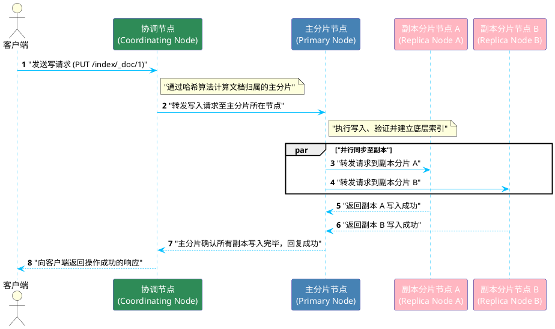

# Elasticsearch 写入流程 (Index/Write) 时序图

结合 `uml` Skill 与 PlantUML 语法规范，我们在此展现一个典型的 Elasticsearch 文档写入（Index）的交互时序图。本次更新特别针对 UML 规范加入了 `skinparam` 全局样式以及个体 `#color` 的配色要求，让角色和流程展示更直观。

**流程要点解析**：
1. 写请求首先经过**协调节点**进行哈希路由（基于 Document ID），定位到对应主分片。
2. **主分片**本地写入成功后，会**并行(par)**将写操作同步至所有副本分片。
3. 必须等到所有配置要求的副本分片返回成功，主节点才会确认，随后系统最终向客户端反馈写入成功，以此保证分布式架构下的数据一致性和高可用性。
